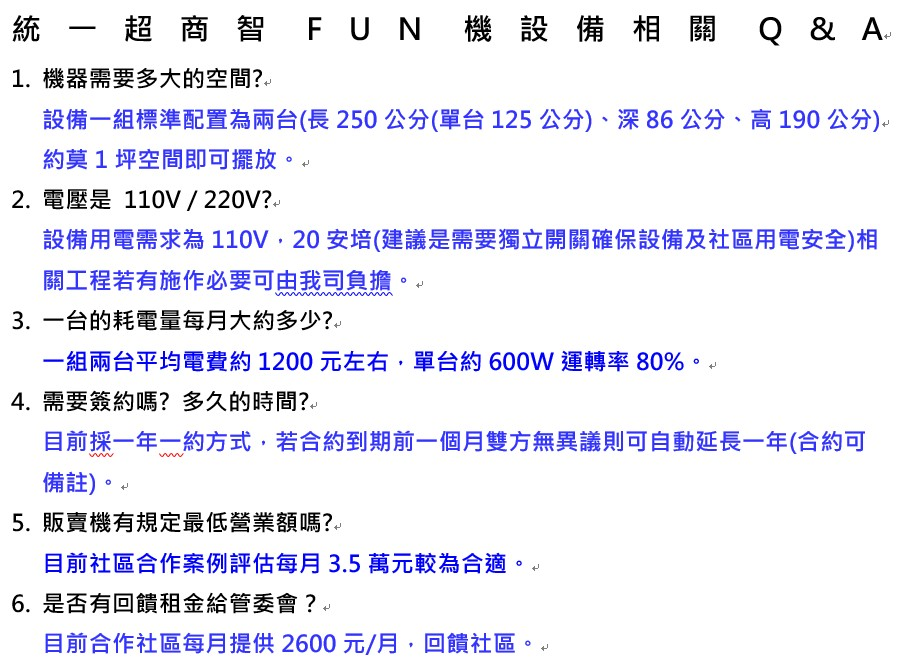

詢問統一超商青峰一樓大廳是否能夠設置販賣機，有沒有什麼限制，得到的答案如下表，目前比較可行的位置為大門口進來左右兩側，靠窗座位區和大門中間空的區域。

實際是否真的需要販賣機，還會評估大悅是開 7-11 門市等因素。

<video width="960" height="540" controls>
  <source src="../assets/img/20210817/01_002.mp4" type="video/mp4">
Your browser does not support the video tag.
</video>