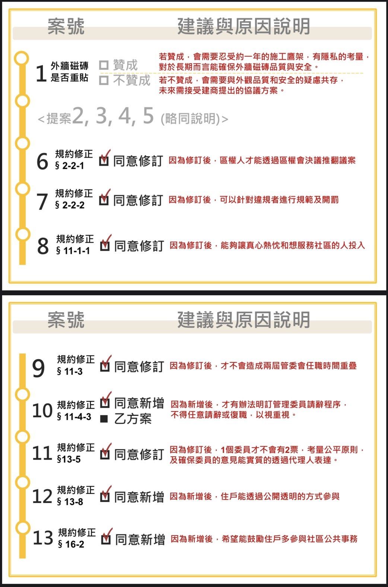
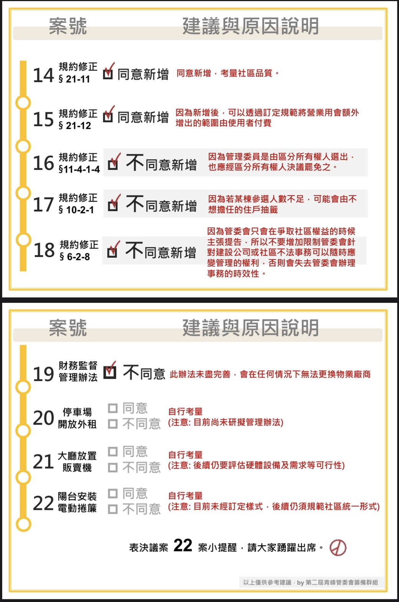

籌備會經過幾週的開會討論，將議題內容及其優缺點，彙整成一份易於閱讀的檔案，期盼好鄰居們撥冗閱覽，共同關注社區發展🙏🙏🙏

[區權會議題勾選建議書(懶人包)](../assets/post/20210822/01_lazy_bag.pdf)為 8/28（六）區權會當天，選舉人會拿到的選票內容模擬。

除了懶人包外，想了解更透徹的也可以參考[提案單附件草案總說明及對照表](../assets/post/20210822/01_proposal_attachment.pdf)，記錄籌備會 10 個提案，包含總說明及修正對照表。

時間: 2021/08/28 (六) 下午1點

附件:
- [區權會議題勾選建議書(懶人包)](../assets/post/20210822/01_lazy_bag.pdf)
- [提案單附件草案總說明及對照表](../assets/post/20210822/01_proposal_attachment.pdf)

