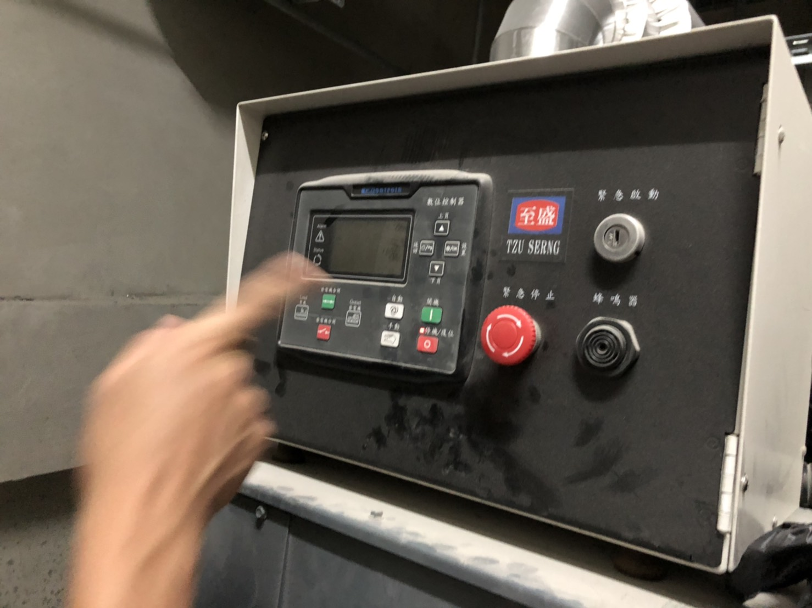
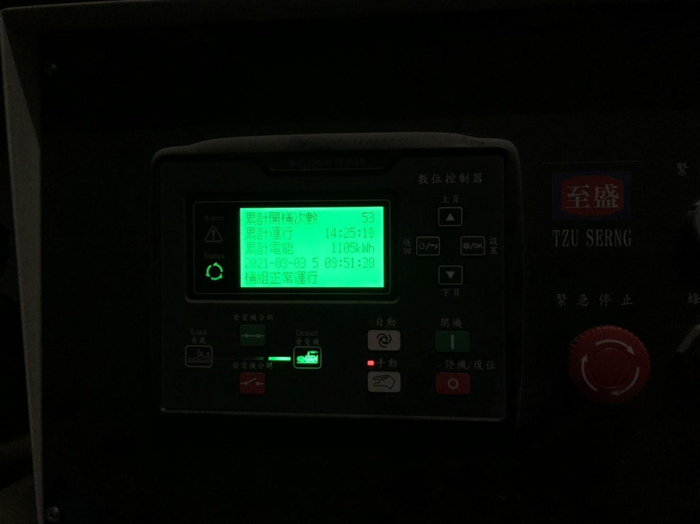
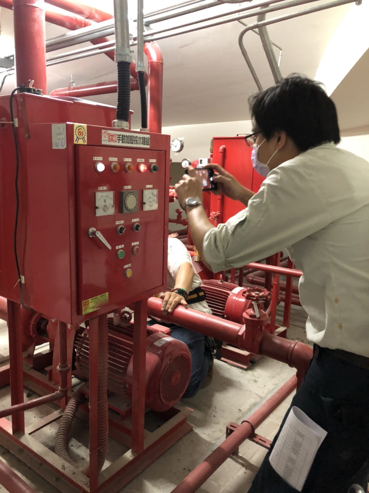
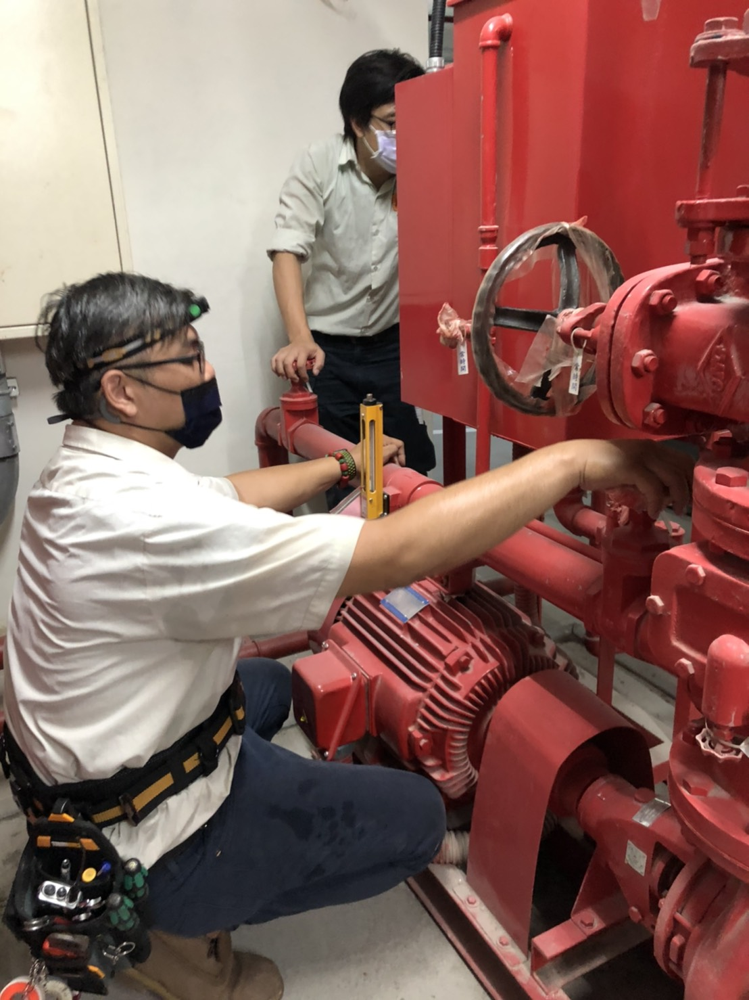
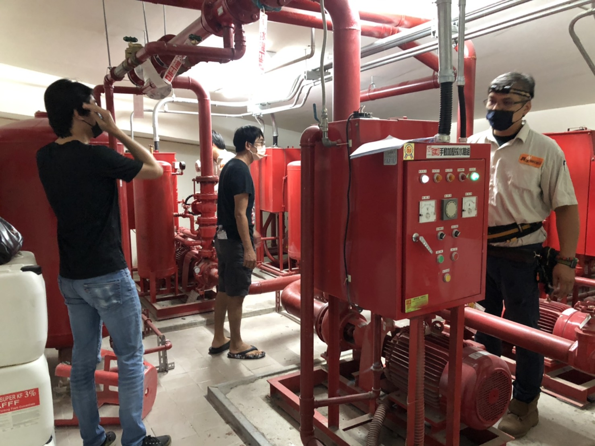
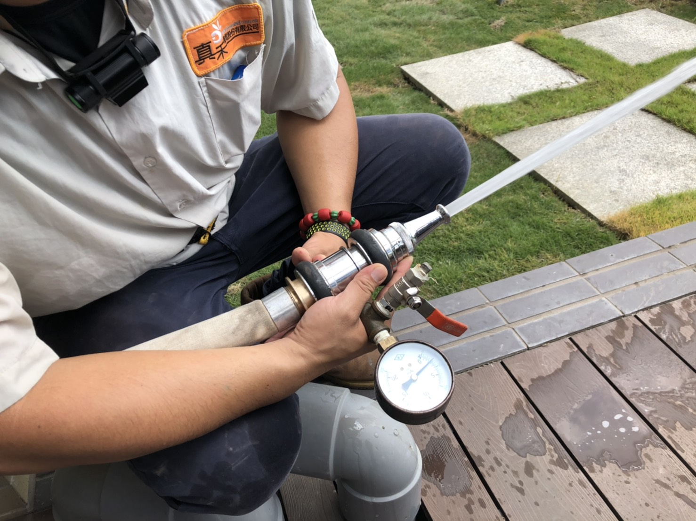
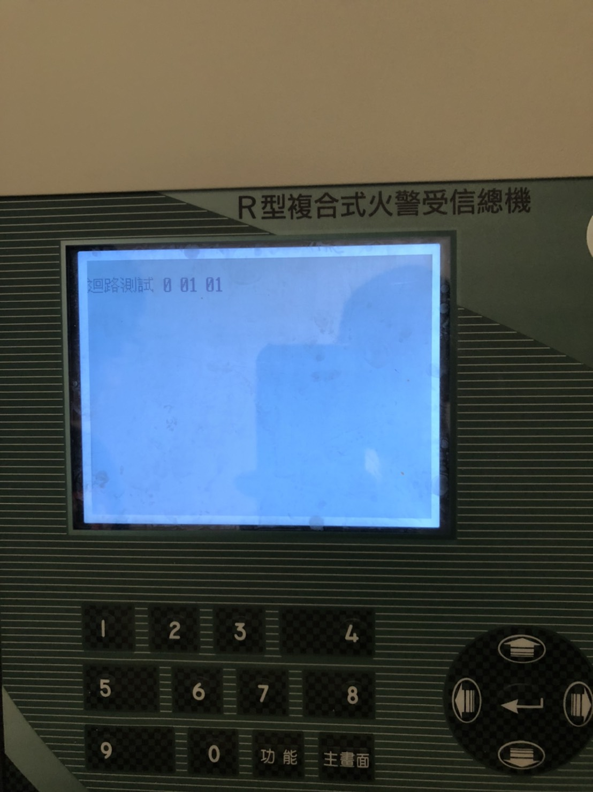
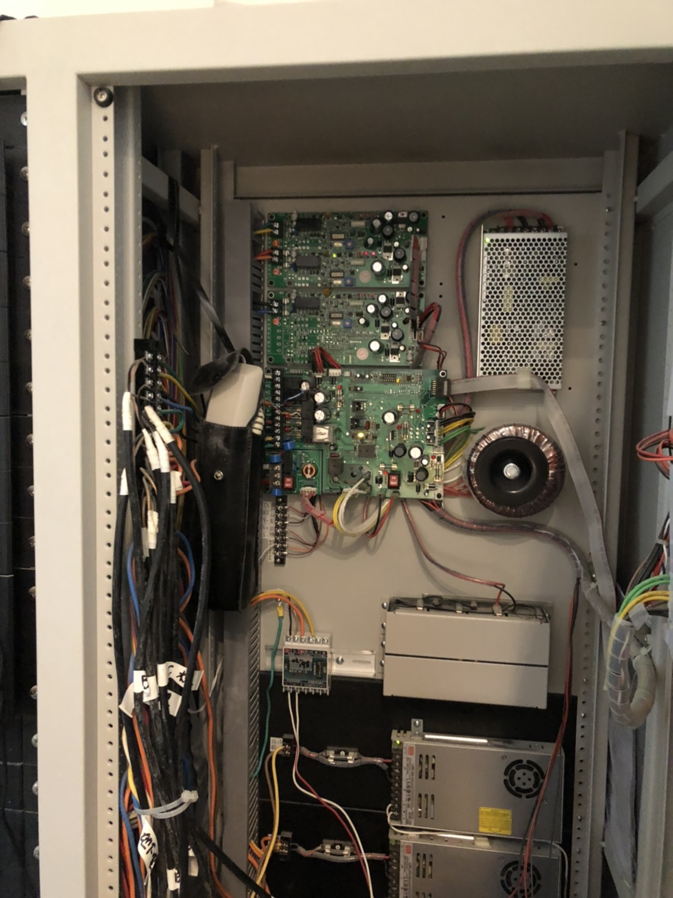
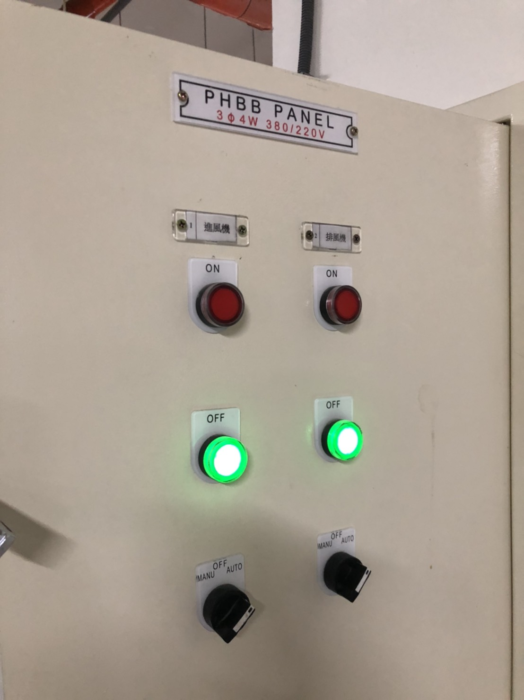
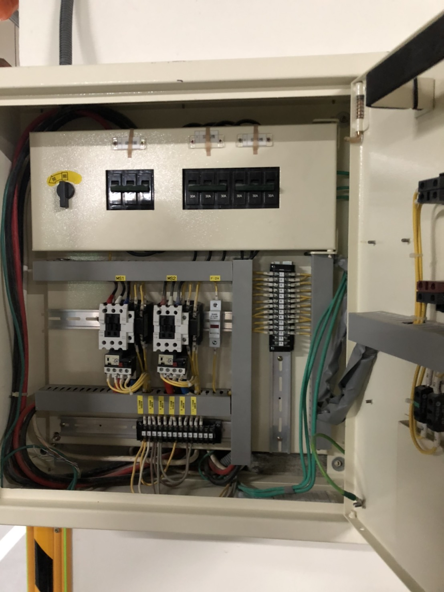

今日是真禾機電消防檢測日，是有關於社區年度消防申報的行程。

有關缺失以真禾機電消防檢修申報為主。

大概跟住戶簡報今日檢測摘要。

檢測項目如下：
1. 消防警報設備。
2. 消防機組（消防泵.泡沫泵.灑水泵.採水泵）。
3. 排煙設備（B1-B5梯廳強排）。
4. 標示照明。
5. 初驗報告消防類缺失複查。

本次消防檢查用發電機的電去測試消防機組，避免契約容量超約。

### ㄧ、發電機檢測（斷電大公）

09:35 斷電（大公）10:50 回復。

重大爭議缺失：
1. 在 09:32 進入發電機室後發現機組設置為「手動模式」（應為自動，又有不明人士去動過）。

2. 發電機房內大量材料/垃圾堆積散落。

缺失影響後果：
1. 若沒設置自動模式，發電機組無法第一時間啟動供緊急用電，會產生同7/1住戶受困電梯狀況。
2. 雜物有易燃風險。

<video width="384" height="216" controls>
  <source src="../assets/post/20210903/01_03.mp4" type="video/mp4">
Your browser does not support the video tag.
</video>

### 二、消防機組測試
以發電機組負載，測試消防泵.泡沫泵.灑水泵.採水泵。

1. 測試各泵浦運轉。
2. 檢查泡沫液容量。
3. 進行 1F 採水泵口送水。
4. 進行 RF 送水。

### 三、斷電ABC棟小公
（各棟電梯與抽檢排煙設備）
1. 發電機組順利啟動(自動模式)。
2. 電梯電源轉換正常。
3. 因火警受信總機當機，啟動排煙設備無反應，改由（公電）測試排煙設備。

重大爭議缺失：
1. 在啟動發電機狀況下。警衛室火警受信總機「當機二次」。無法廣播，無法使用發電機負載排煙設備。
2. B 棟排煙設備控制盤故障，無法啟動測試。

以今日測試的情境，失火+斷電，縱使發電機啟動，在火警受信總機當掉的情況下，住戶無法收到警報通知，排煙設備無法順利開啟，會造成重大事件。

本次測試發電機組啟用5次（累計開機次數53-58），真禾最後是以設定自動模式下，上鎖離開發電機室。

