今天去拜訪我們的兄弟社區翠峰，請教翠峰張主委管委會運作、社區經營、物業管理，如何跟建商談判等經驗，並參觀翠峰的硬體設施。

以下整理和翠峰交流摘要:

1. 公設訂定使用管理辦法：免費（如：兒童室）、點數制(如：健身房)、時段收費制（如：烘焙教室、會議室、瑜伽室)。
2. 特殊設施/服務：未來預計引進生鮮機（costco牛奶雞蛋等）、熟食機（賣便當等）。
3. 資訊公告方式：
   1. 1 樓有大電視螢幕閃播推播社區公告（但不建議，因為很少人會駐足，且閃播對使用者接受資訊不易）。
   2. 電梯內有分眾傳播電子看板（每台月租金500元給社區）。
   3. 未來會使用壓克力板*6個設在1樓電梯口外，作為公告固定所。
4. 社區服務:
   1. 1F：7-11自動販賣機、i 郵件櫃、吧台無秘書只提供簡單茶飲（有收費$20~$50/杯，有需要的時候由秘書泡，再採自助回收到水槽，秘書下班前會統一清潔）。
   2. 廚藝教室內一處有衣架 與乾洗衣店合作社區衣物送行服務。
   3. Ｒ樓有曬衣棚（真的有人在用）、小農菜園。
   4. 廚藝教室內一處有衣架 與乾洗衣店合作社區衣物送行服務。
5. 硬體相關：
   1. 地下室有垃圾冷藏（上進實業）(他們把建商的廚餘冷藏丟掉）。
   2. 防火門關起來都不會碰一聲、關門鎖也不會一直響。
6. 物業相關：建議物業招標時要開需求書，由物業來依社區的需求服務。（有提到也可以找和委員人數相同的住戶代表一起作為評審團）。
7. 其他：
   1. 公電有去調費率，大概便宜幾千塊。
   2. 園藝每月一次大概8千～1萬 。
   3. 未來地下室B1出入口要增設鏡頭和螢幕看對向來車。
   4. 無使用地下室機車中柱鐵板（不建議，因為有看到其他社區有生鏽）。
8. 建商交涉：公設點交已完成，列出願望清單給建商後，談成150萬回饋金。（該社區硬體大多無問題、地下室也沒有漏水的情況）。
   - 建商是對新潤興業經理、營造是對國原營造（亞昕）。

頂樓

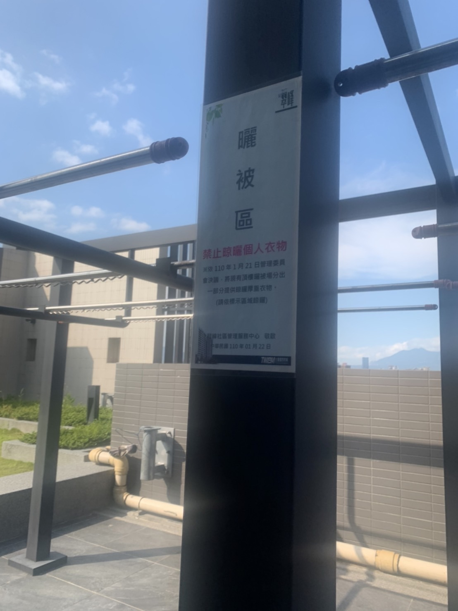

電子看板

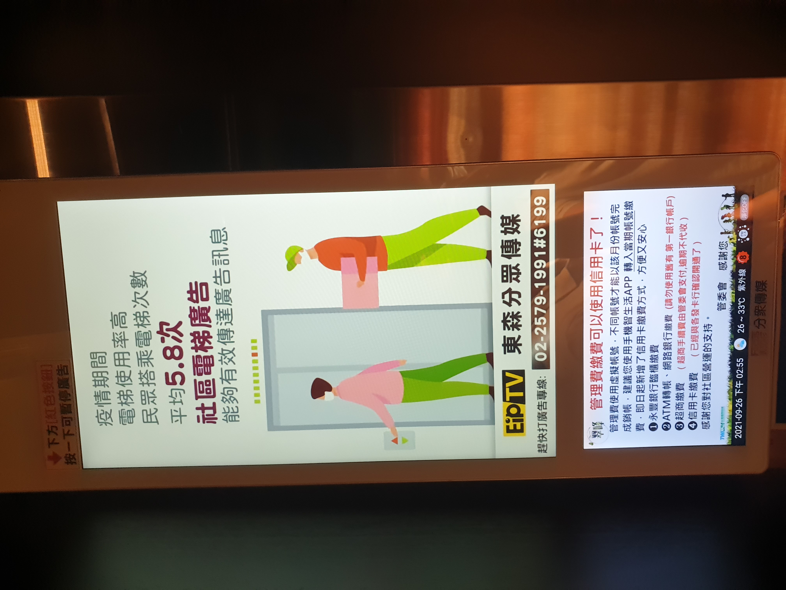

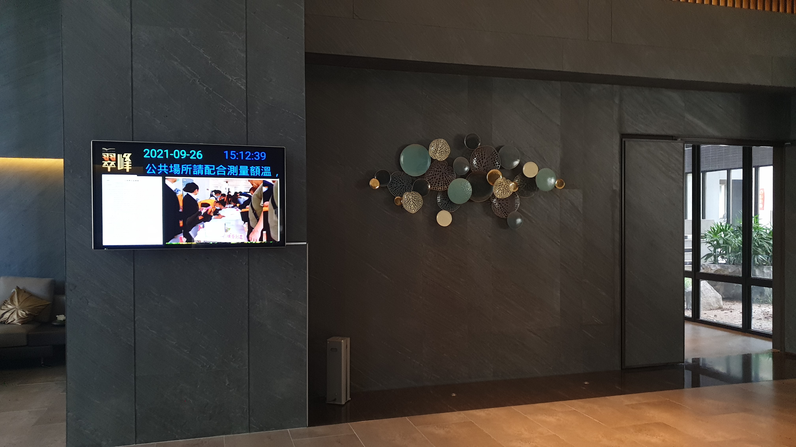

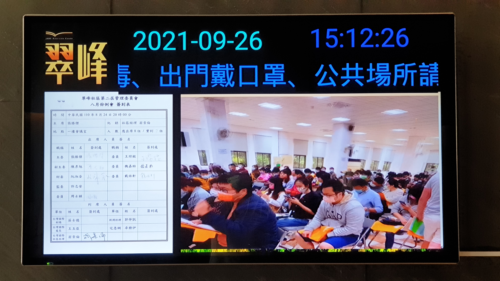

防火門開關

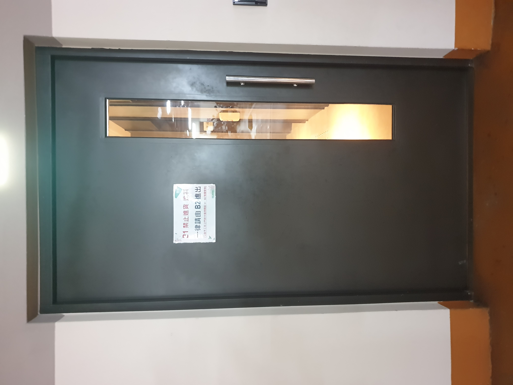

<video width="216" height="384" controls>
  <source src="../assets/post/20210926/community/03_02.mp4" type="video/mp4">
Your browser does not support the video tag.
</video>

垃圾冷藏

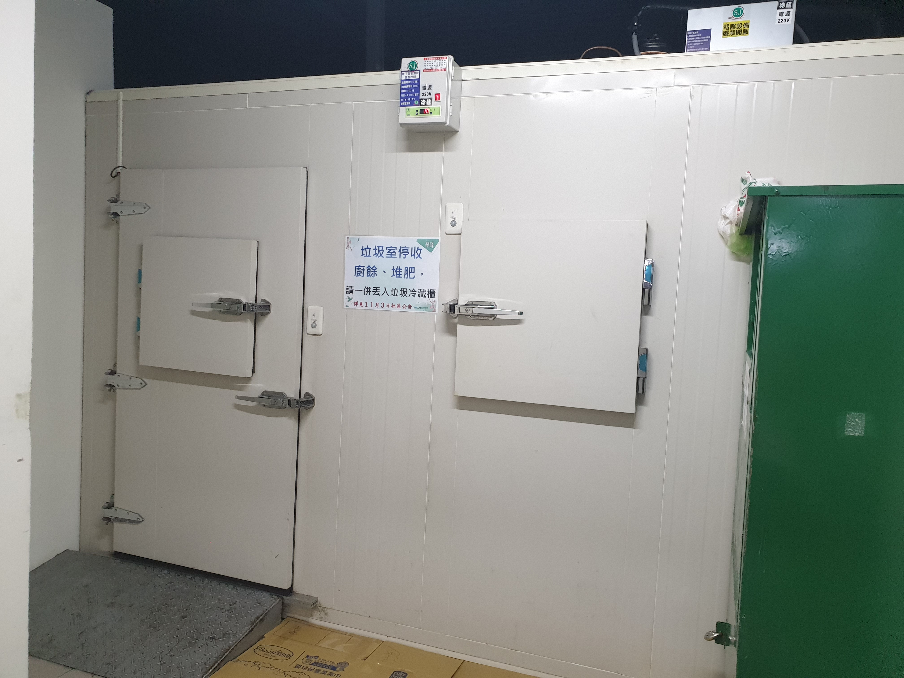

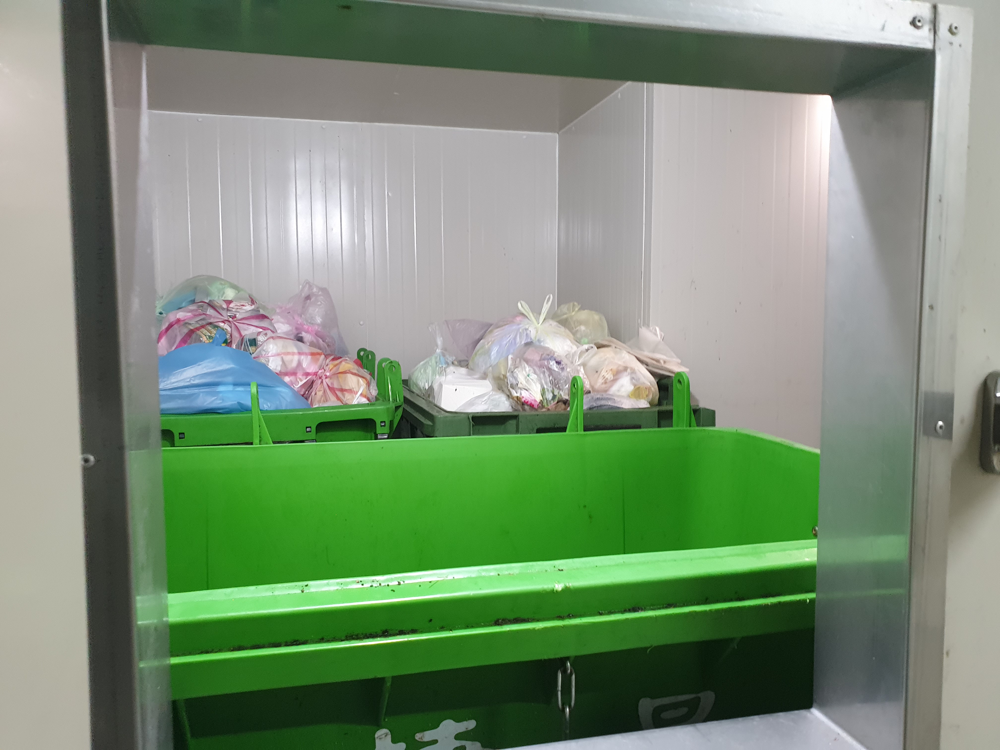

停車場

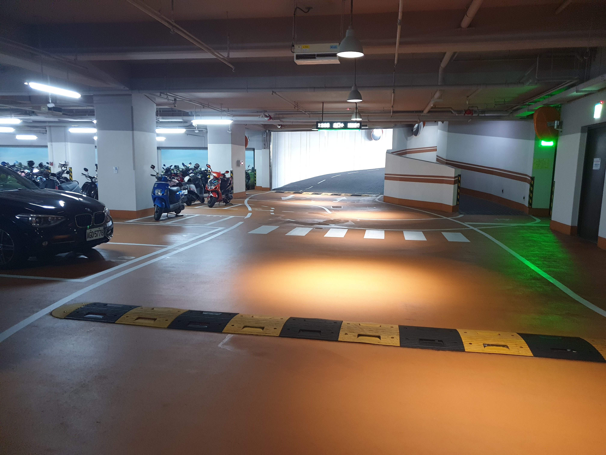

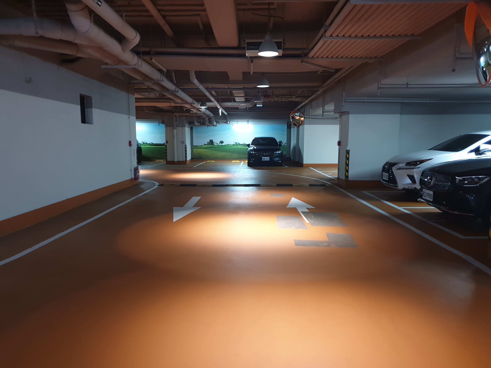

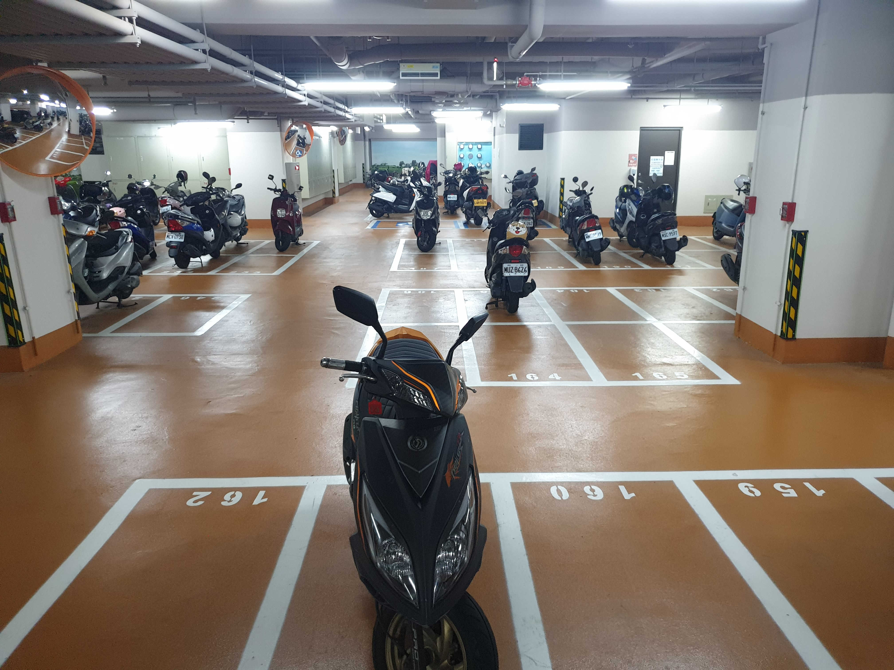

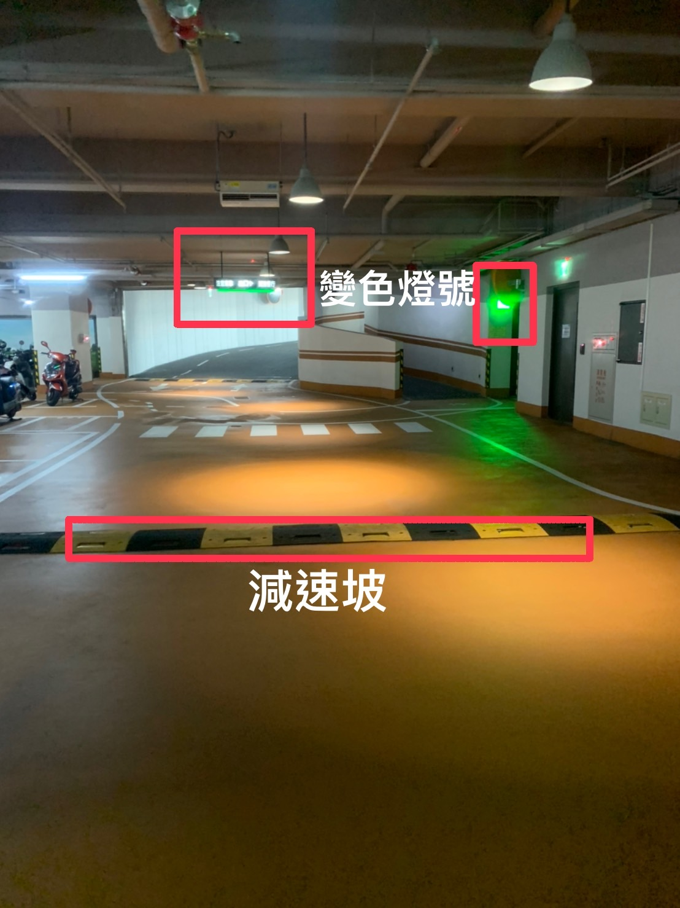

大廳

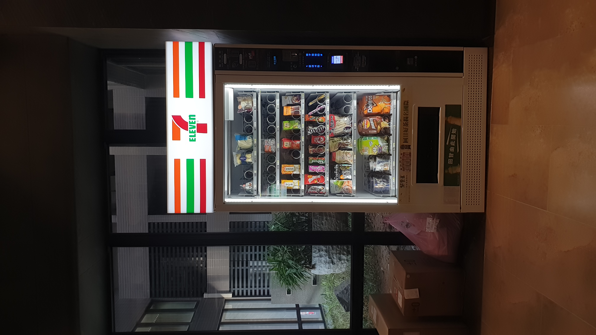

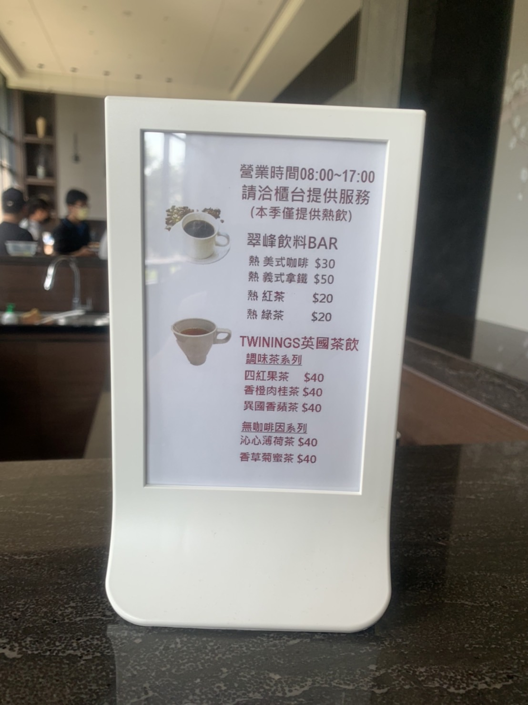
