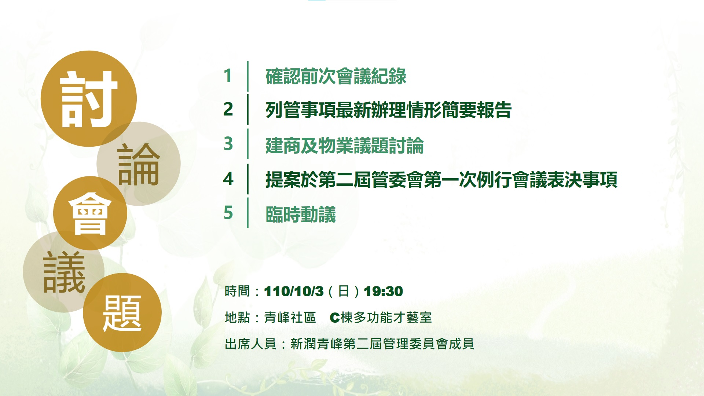

線上會議連結：[https://youtu.be/EX-ME7AW96w](https://youtu.be/EX-ME7AW96w)

討論主題:

1. 確認前次會議紀錄
2. 列管事項最新辦理情形簡要報告
3. 建商及物業議題討論
4. 提案於第二屆管委會第一次例行會議表決事項

相關附件下載:

1. [討論會簡報](../assets/post/20211003/1101003_01_討論會簡報.pdf)
2. [建商開會討論議題](../assets/post/20211003/1101003_02_建商開會討論議題.pdf)
3. [物業開會討論議題](../assets/post/20211003/1101003_03_物業開會討論議題.pdf)
4. [新潤青峰社區-檢修申報受理單](../assets/post/20211003/1101003_04_新潤青峰社區-檢修申報受理單.pdf)
5. 新潤青峰第二屆管理委員會第四次社區事務討論會紀錄