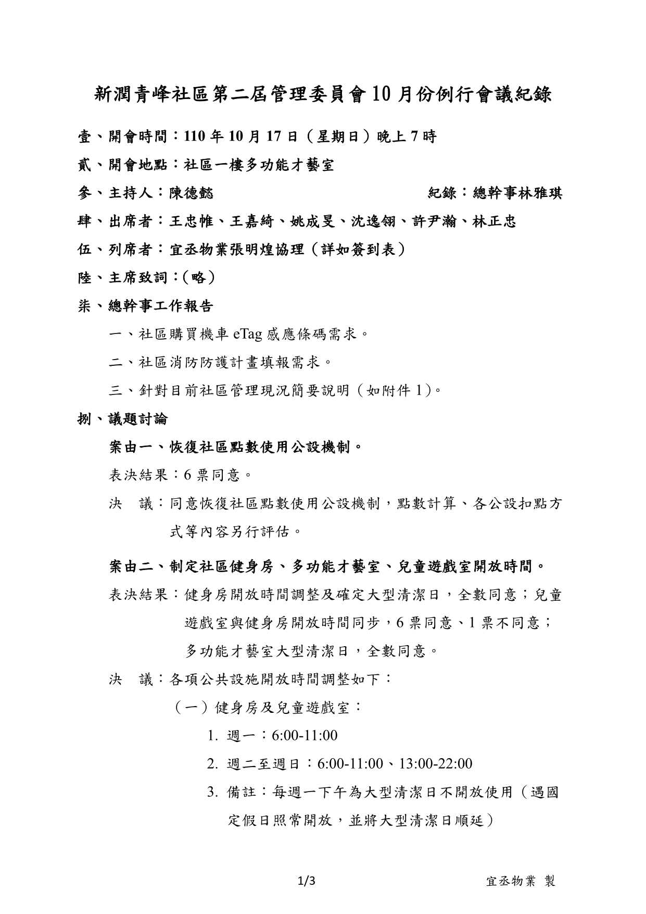
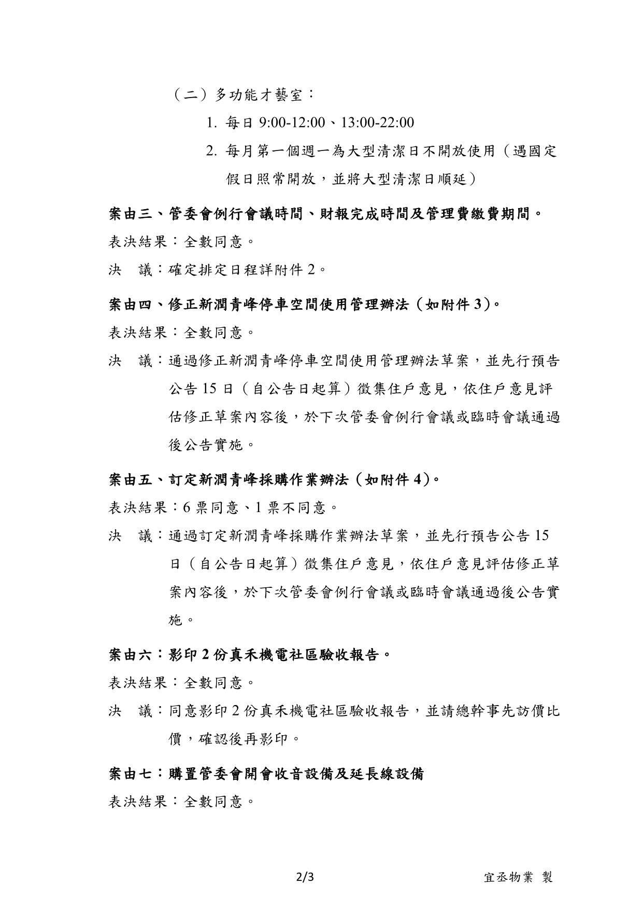
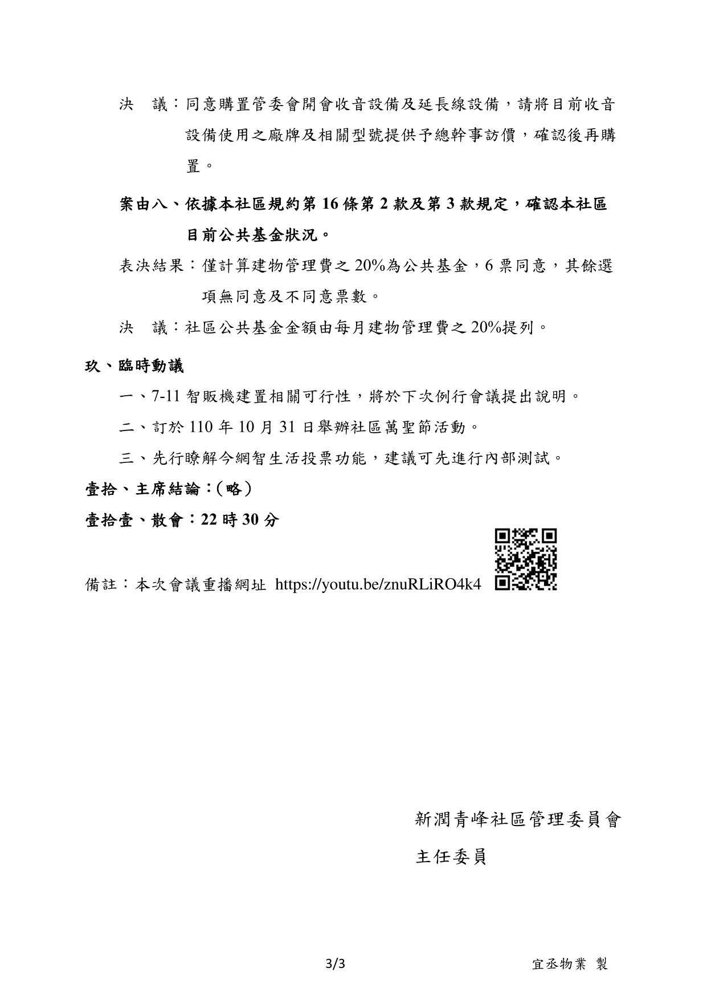

- 議題：
- 1.恢復社區點數使用公設機制。
- 2.制定社區健身房、多功能才藝室、兒童遊戲室開放時間。
- 3.管委會例行會議時間、財報完成時間及管理費繳費期間。
- 4.修正新潤青峰停車空間使用管理辦法。
- 5.訂定新潤青峰採購作業辦法。
- 6.影印2份真禾機電社區驗收報告。
- 7.購置管委會開會收音設備及延長線設備。
- 8.依據本社區規約第16條第2款及第3款規定，確認本社區目前公共基金狀況。

線上會議連結：[https://youtu.be/znuRLiRO4k4](https://youtu.be/znuRLiRO4k4)

相關附件下載:

1. [新潤青峰第二屆管理委員會10月份例行會議紀錄（第二屆第1次例行會）](../assets/post/20211017/1101017_01_新潤青峰第二屆管理委員會10月份例行會議紀錄（第二屆第1次例行會）.pdf)
2. [附件1-物業針對社區管理現況簡要說明](../assets/post/20211017/1101017_02_附件1-物業針對社區管理現況簡要說明.pdf)
3. [附件2-管委會會議、財報期限排程](../assets/post/20211017/1101017_03_附件2-管委會會議、財報期限排程.pdf)
4. [附件3-新潤青峰停車空間使用管理辦法草案](../assets/post/20211017/1101017_04_附件3-新潤青峰停車空間使用管理辦法草案.pdf)
5. [附件4-新潤青峰社區採購辦法(草案)](../assets/post/20211017/1101017_05_附件4-新潤青峰社區採購辦法(草案).pdf)
6. [討論會簡報](../assets/post/20211017/1101017_06_討論會簡報檔.pdf)
7. [開會通知單](../assets/post/20211017/1101017_07_開會通知單.pdf)

會議紀錄快速瀏覽:

