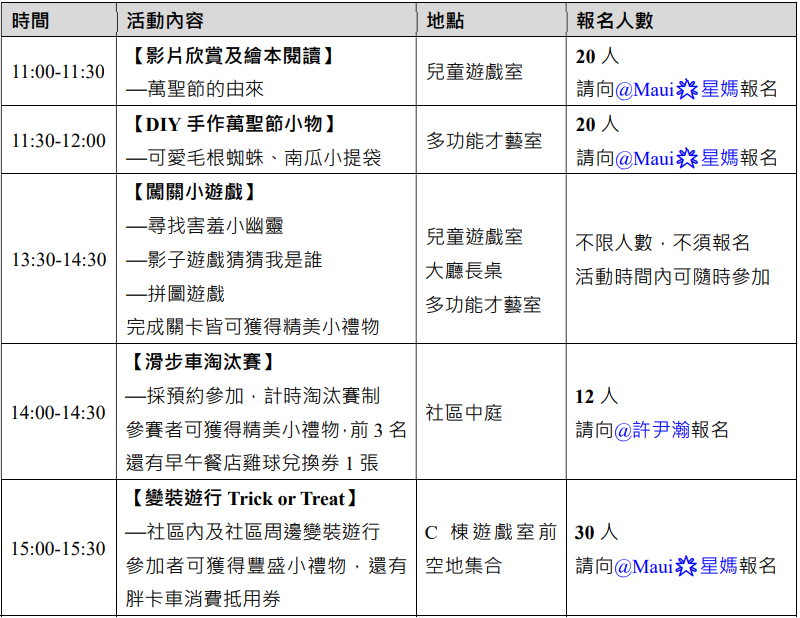

由社區管委會與住戶自發組成，在社區內辦理㇐系列萬聖節活動。透過影片欣賞與繪本閱讀的方式讓小朋友認識萬聖節的由來，再舉辦各種 DIY 手作、闖關遊戲、滑
步車競賽及變裝不給糖就搗蛋活動，同時於社區外有可麗餅及飲料胖卡車駐點，各闖關遊戲及變裝遊行提供孩子精美小禮物，給孩子跟住戶們㇐個充滿歡樂氣息的萬聖節。

活動時間：110 年 10 月 31 日（日）11:00-16:00 

活動簡報：[下載](../assets/post/20211031/01_halloween.pdf)

活動內容：

活動照片：

**11:00 ~ 11:30 影片欣賞及繪本閱讀**

星媽和 Nini 當老師，跟小朋友們以繪本和影片方式說明萬聖節的由來，小朋友們都很踴躍的提問，因為報名的小朋友很多有分成兩班來上課，經過這場活動後小朋友們對萬聖節都有更深刻的認識。

**11:30 ~ 12:00 DIY 手作萬聖節小物**

熱心的鄰居們，帶著小朋友從布料開始一步步自己動手做，爸爸媽媽也一起幫忙，親子協力完成可愛毛根蜘蛛和南瓜小提袋，完成後小朋友都開心的拿著自己的作品請爸媽們幫忙合照。

**13:30 ~ 14:30 闖關小遊戲**

影子遊戲猜猜我是誰，透過剪影猜猜卡通人物，有皮卡丘、瑪莎與熊、佩佩豬、汪汪隊、巧虎等卡通人物，幾乎每位小朋友都完全答對，真的很厲害👍

拼圖遊戲則是考驗小朋友的耐心，能不能靜下心來一片一片把拼圖給完成，想當然也幾乎每位小朋友都完成了拼圖😎

**14:00 ~ 14:30 滑步車小比賽**

大人們有 MotoGP 世界摩托車錦標賽，小朋友們滑步車小比賽，賽事使用淘汰制，每位選手都使出吃奶的力量，過彎時還有甩尾和壓車，真的是太刺激了，完全變成小朋友們的粉絲啊😆

**15:00 ~ 15:30 變裝遊行 Trick or Treat**

在青峰廣場集合，開始社區內及社區周邊變裝遊行，每位大小朋友都使出渾身解數，用心的打扮，沿途經過可麗餅餐車 > 置身室外 > 翠峰 > 最後返回青峰廣場，聲勢相當的耗大，江翠北最大變裝遊行就在青峰。

**15:30 ~ 16:00 魷魚遊戲 123 木頭人**

搭上今年最火熱的魷魚遊戲，123 木頭人動了就輸了，小朋友玩的不亦樂乎，連跌倒姿勢都那麼的棈采，最佳男主角就是你😍

[魷魚遊戲 123 木頭人影片](https://www.youtube.com/embed/us2GCm2Yc5E)

<iframe width="560" height="315" src="https://www.youtube.com/embed/us2GCm2Yc5E" frameborder="0" allow="autoplay; encrypted-media" allowfullscreen></iframe>

**16:01 大合照**

工作人員和所有的鄰居一起大合照，這次活動大小朋友都玩的很開心，下一次 2021/12/25 的聖誕節活動也已經規劃，有 Switch 瑪利歐賽車大賽、紅旗綠旗舉起來、聖誕老人發禮物、聖誕市集擺攤活動，想擺攤的鄰居快快報名起來，相關資訊可以參考 [2021-青峰聖誕節活動](../assets/post/20211225/2021_青峰聖誕節活動_72.pdf)。

