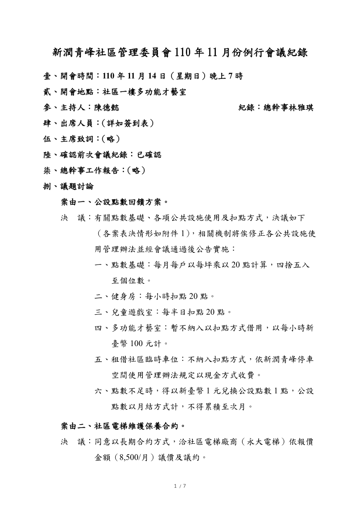
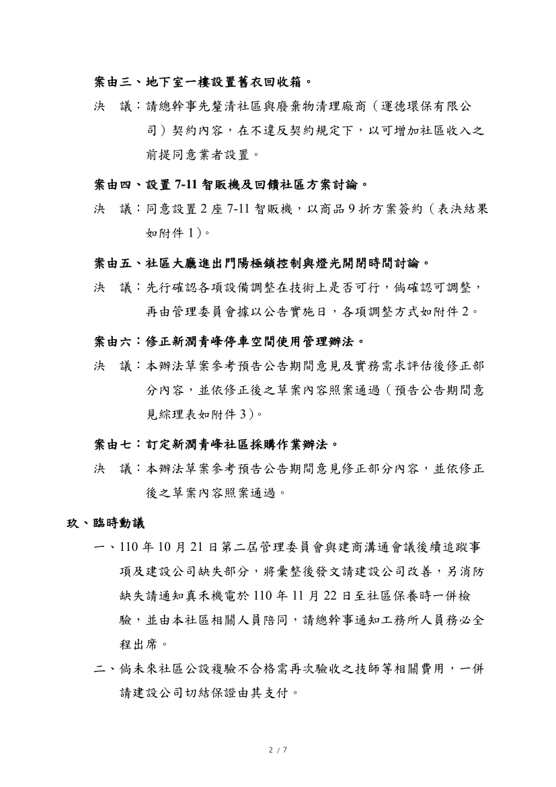
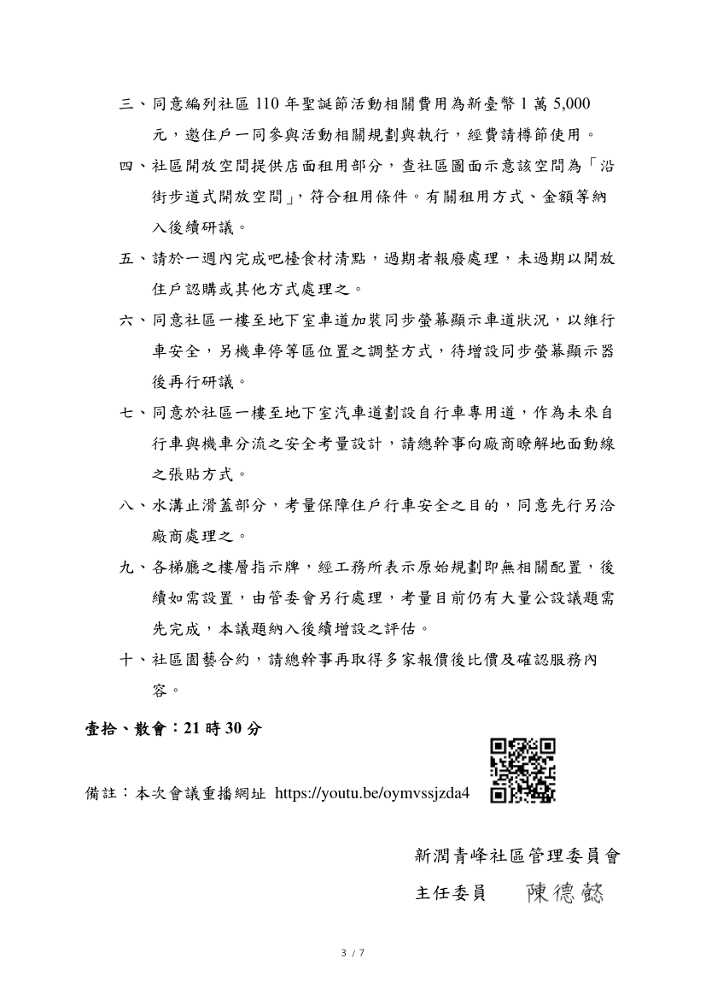
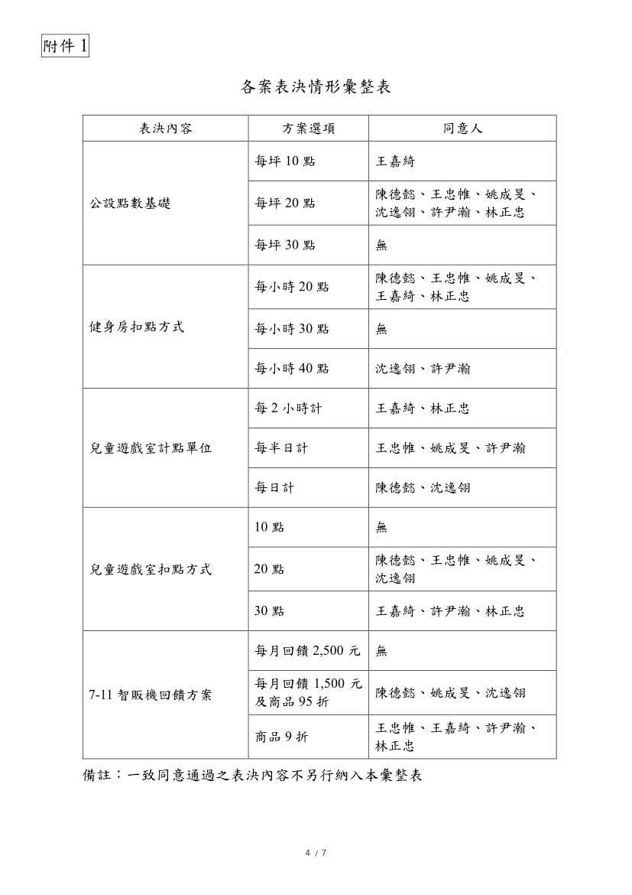
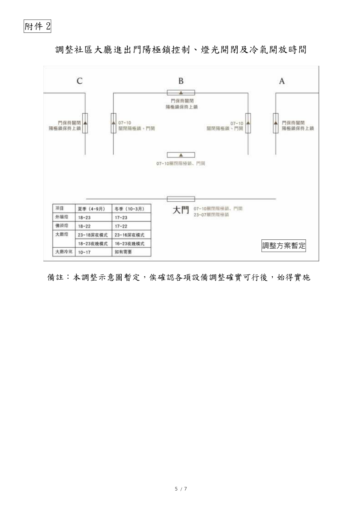
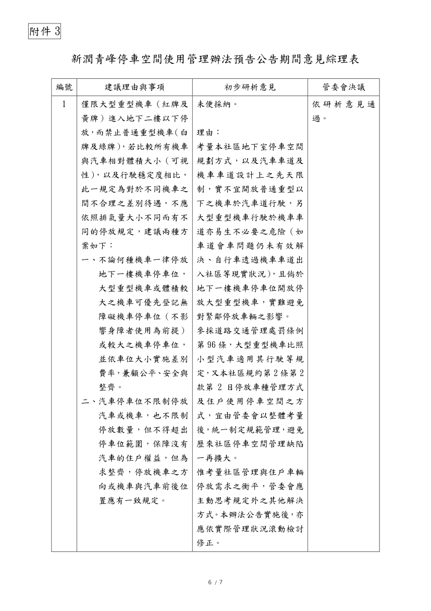
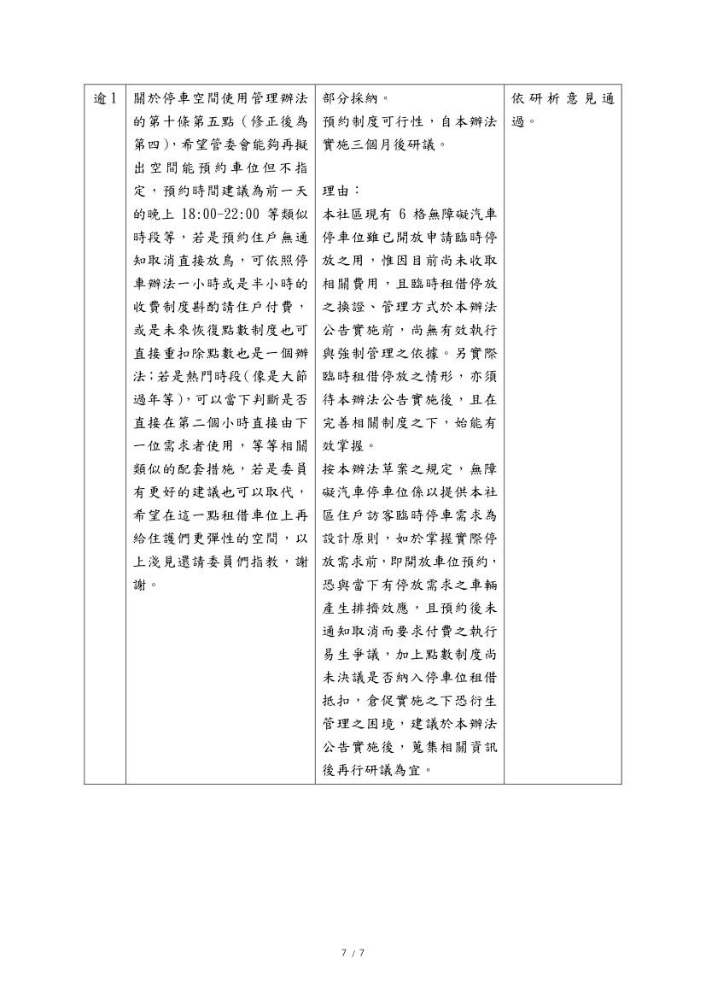

- 議題：
- 1.公設點數回饋方案。
- 2.社區電梯維護保養合約。
- 3.地下室一樓設置舊衣回收箱。
- 4.設置 7-11 智販機及回饋社區方案討論。
- 5.社區大廳進出門陽極鎖控制與燈光開閉時間討論。
- 6.修正新潤青峰停車空間使用管理辦法。
- 7.訂定新潤青峰社區採購作業辦法。

線上會議連結：[https://youtu.be/oymvssjzda4](https://youtu.be/oymvssjzda4)

相關附件下載:

1. [110年11月份例行會議公告](../assets/post/20211114-1/110年11月份例行會議公告.pdf) 
2. [110年11月份例行會議紀錄](../assets/post/20211114-1/110年11月份例行會議紀錄.pdf)
3. [110年11月份例行會議簽到表](../assets/post/20211114-1/110年11月份例行會議簽到表.pdf)

會議紀錄快速瀏覽:

