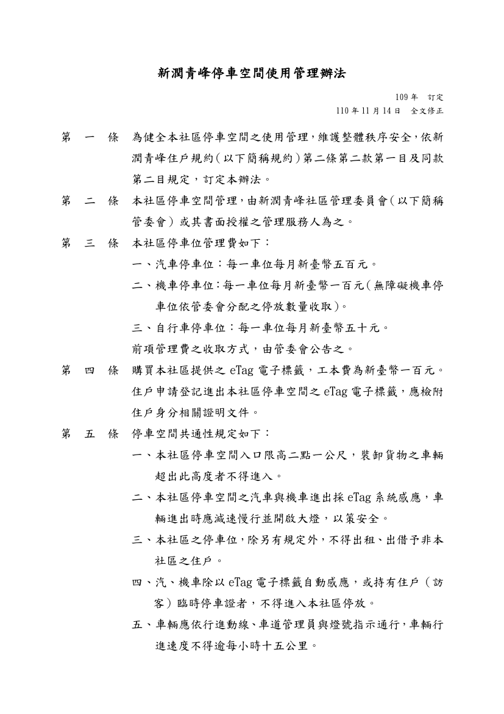
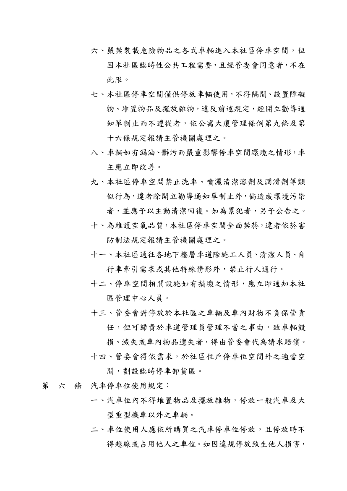
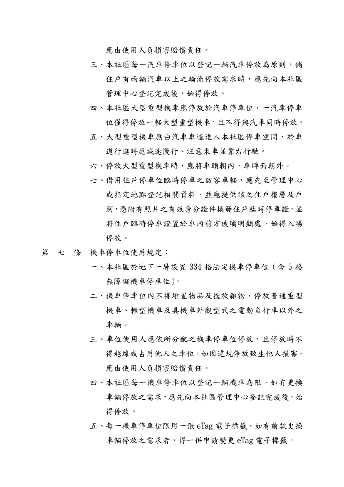
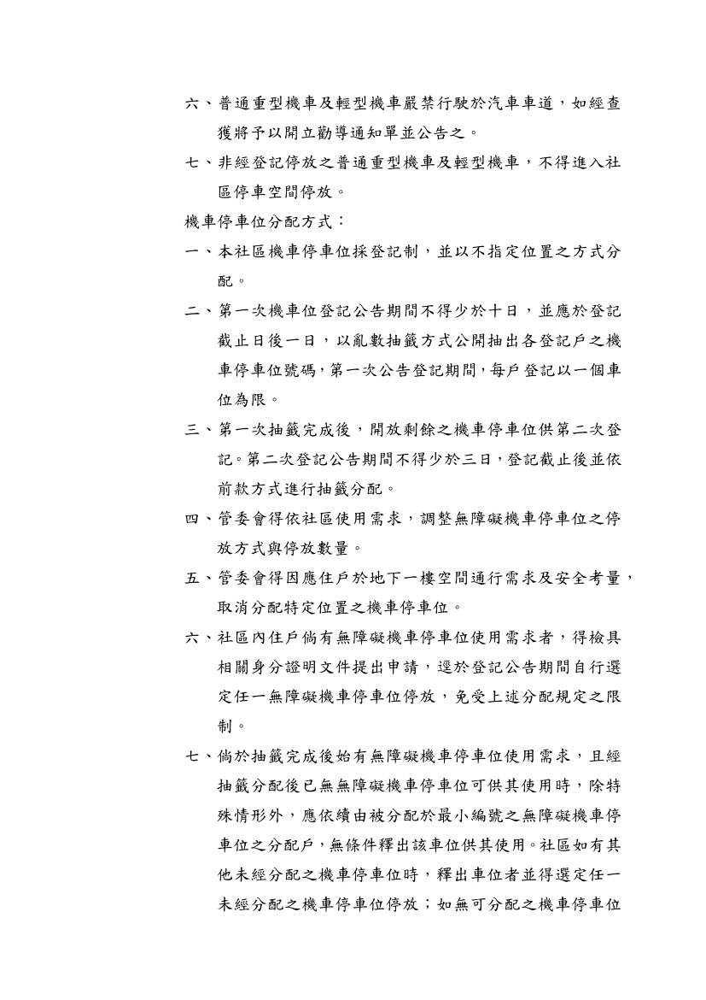
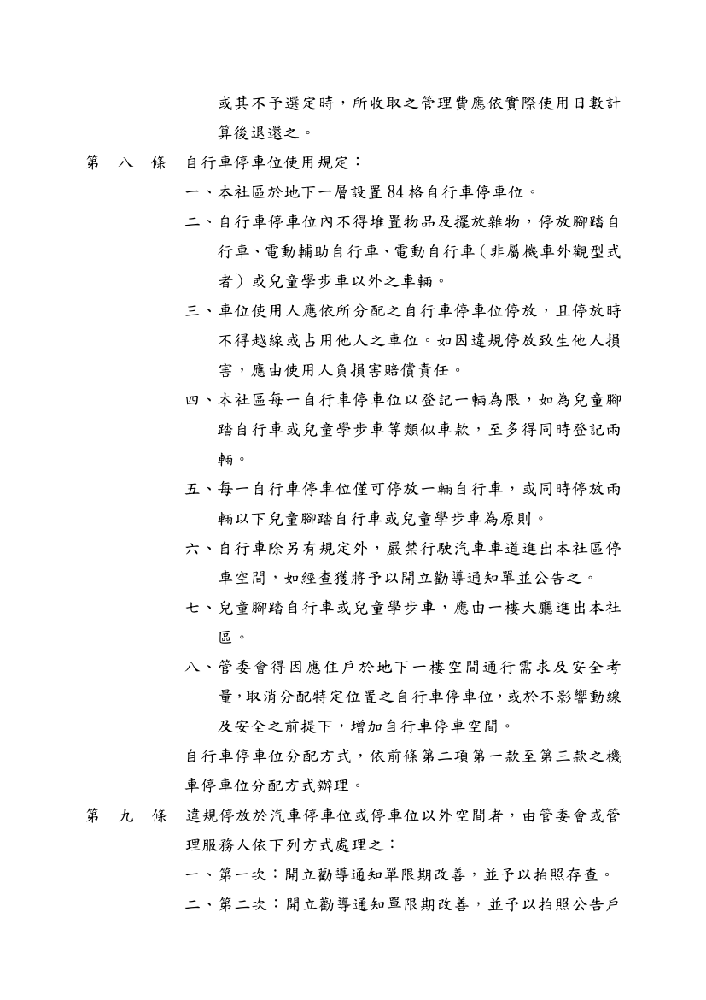
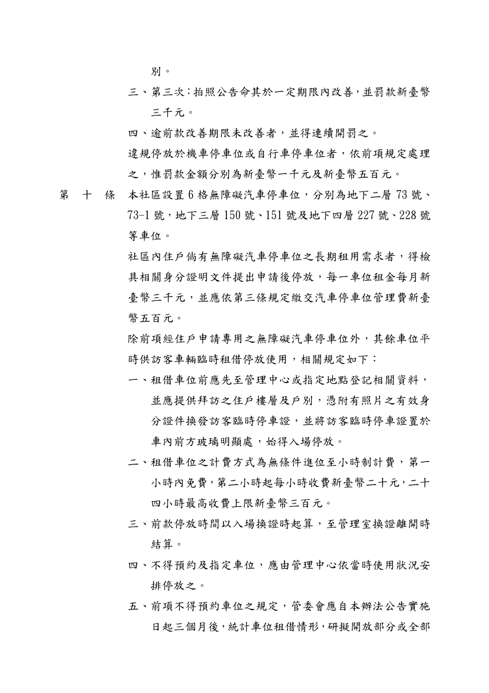
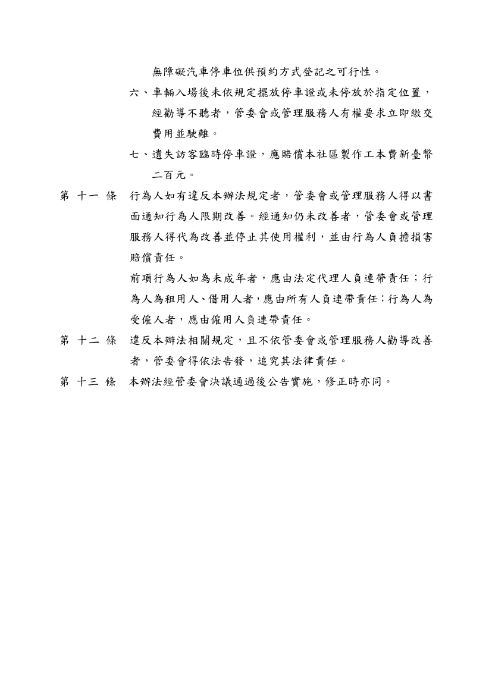

管理辦法：
- 1.依據新潤青峰社區管理委員會[110年10月份例行會議](https://bq01.github.io/2021-11-14-1-meeting/)決議事項辦理。
- 2.附「新潤青峰停車空間使用管理辦法」1 份。

相關附件下載:

[新潤青峰停車空間使用管理辦法](../assets/post/20211114-2/新潤青峰停車空間使用管理辦法.pdf)

### 新潤青峰停車空間使用管理辦法快速瀏覽:

