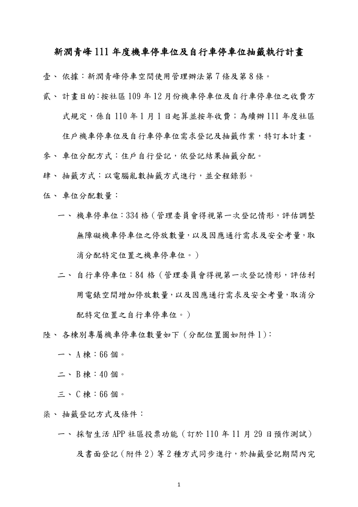
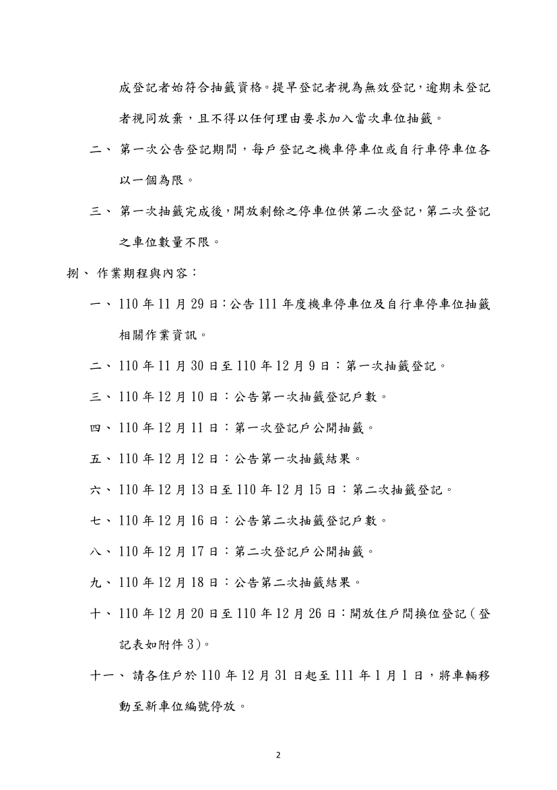
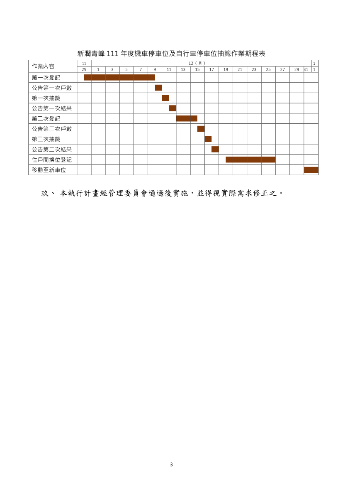
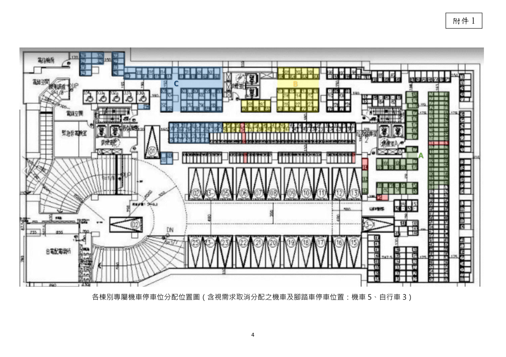
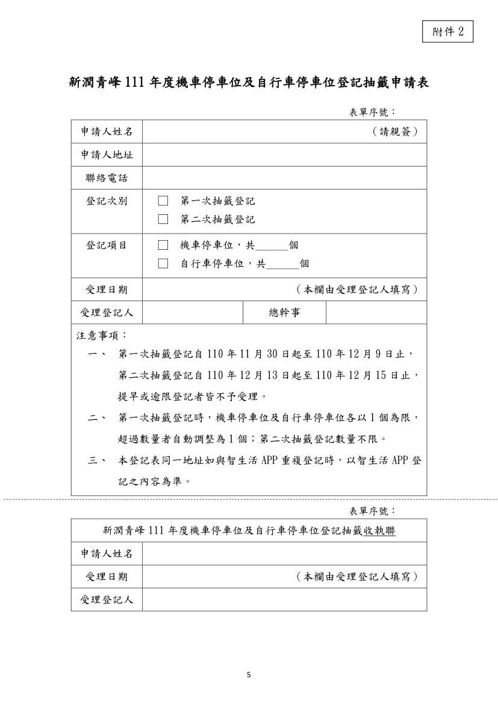

管理辦法：
- 1.依據新潤青峰社區管理委員會[110年11月份第1次臨時會](https://bq01.github.io/2021-11-28-1-meeting/)決議事項辦理。
- 2.附「新潤青峰111年度機車停車位及自行車停車位抽籤執行計畫」1 份。

相關附件下載:

 [新潤青峰111年度機車停車位及自行車停車位抽籤執行計畫](../assets/post/20211211/111年度機車停車位及自行車停車位抽籤執行計畫.pdf) 

### 新潤青峰住戶公共設施點數配發及儲值措施快速瀏覽:

