- 議題：
- 1.機車腳踏車抽籤細節確認。
- 2.公設空間使用管理辦法。

線上會議連結：[https://youtu.be/R9G82dNpWms](https://youtu.be/R9G82dNpWms)

相關附件下載:

1. [110年11月份第1次臨時會議公告](../assets/post/20211128/110年11月份第1次臨時會議公告.pdf)
2. [110年11月份第1次臨時會議紀錄](../assets/post/20211128/110年11月份第1次臨時會議紀錄.pdf)
3. [110年11月份第1次臨時會議簽到表](../assets/post/20211128/110年11月份第1次臨時會議簽到表.pdf)

會議紀錄快速瀏覽:

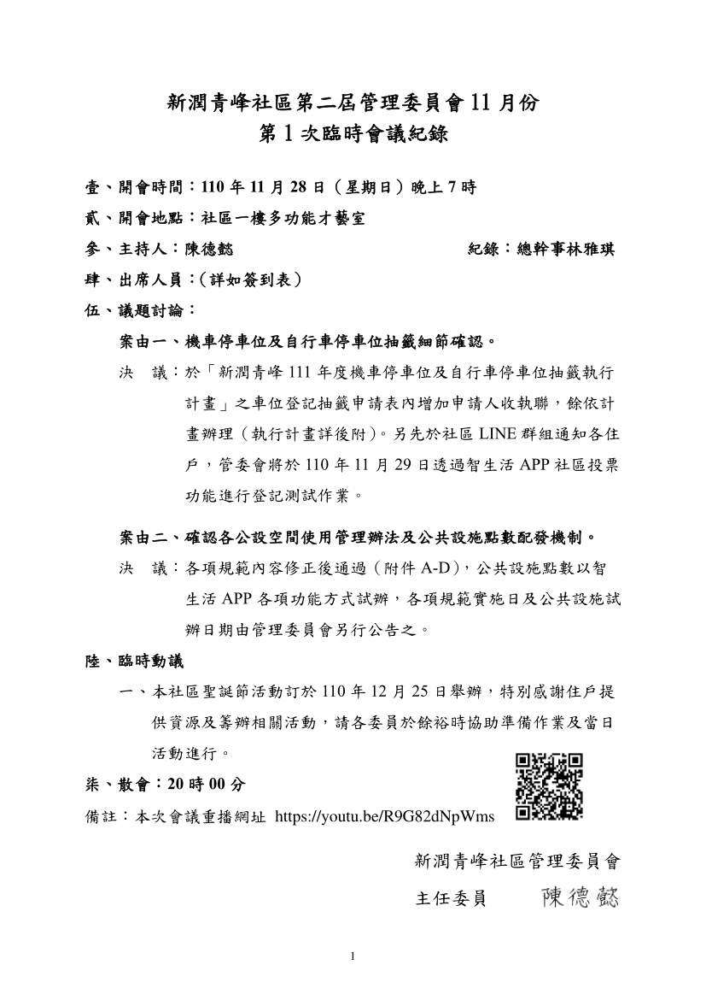
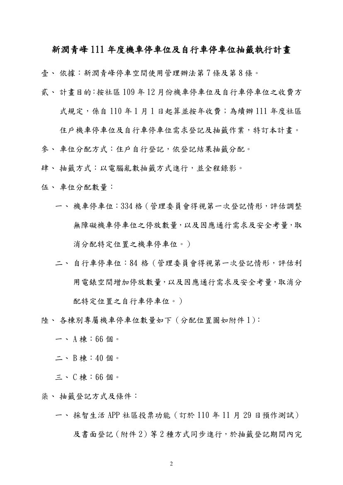
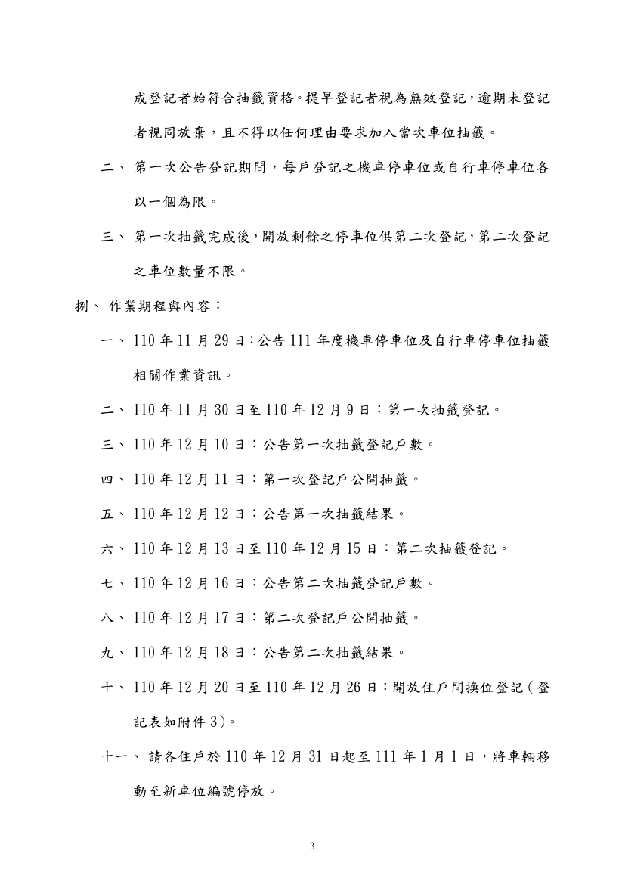
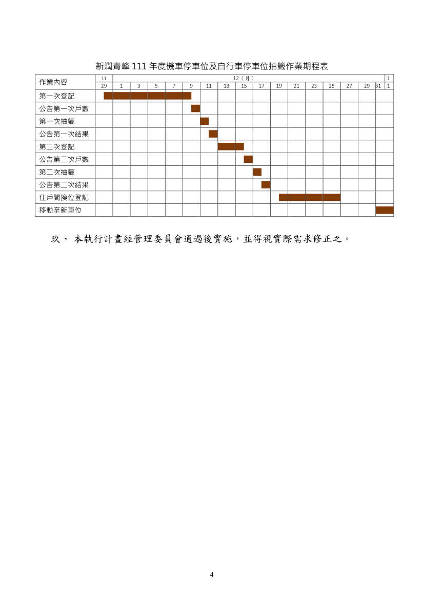
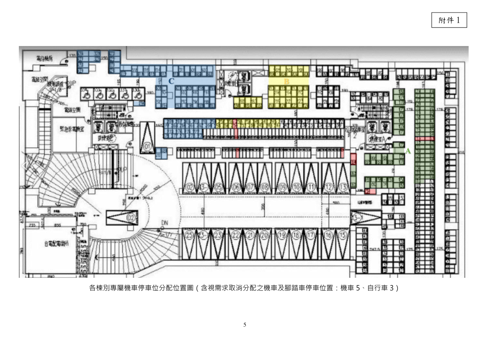
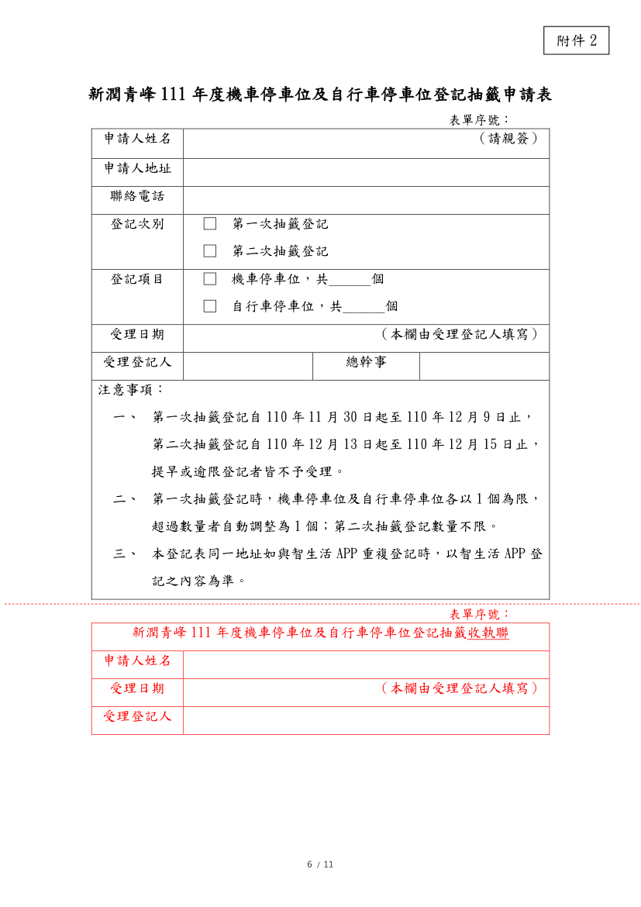
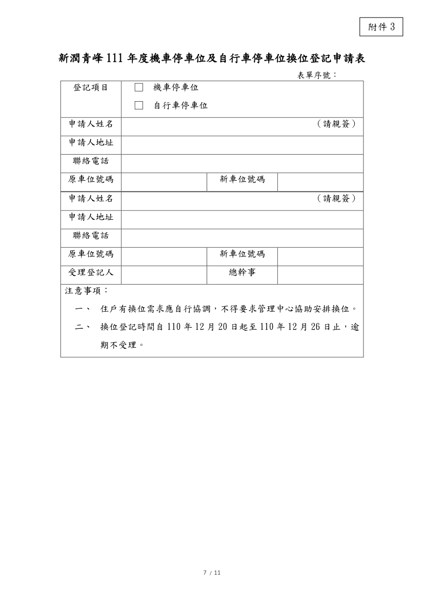
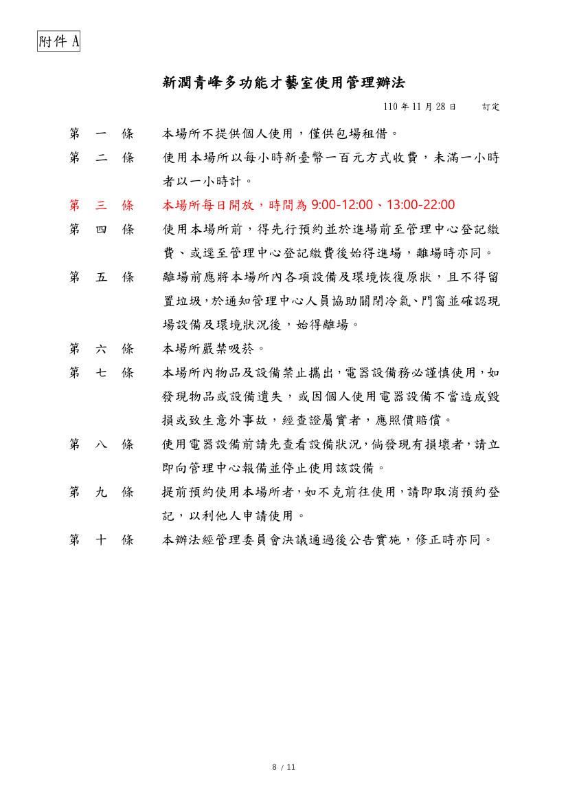
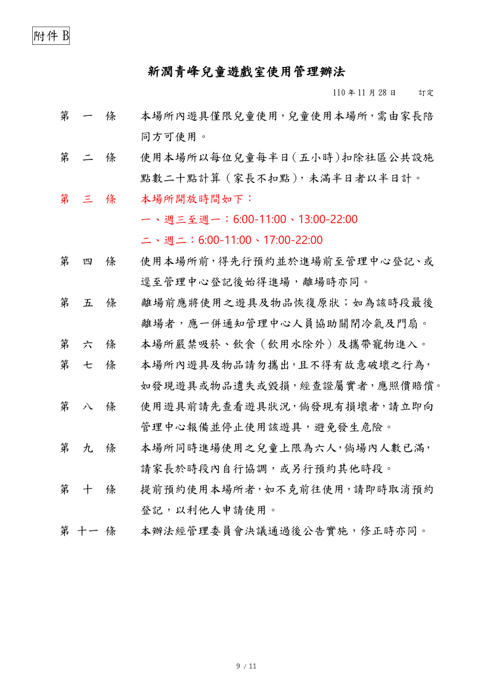
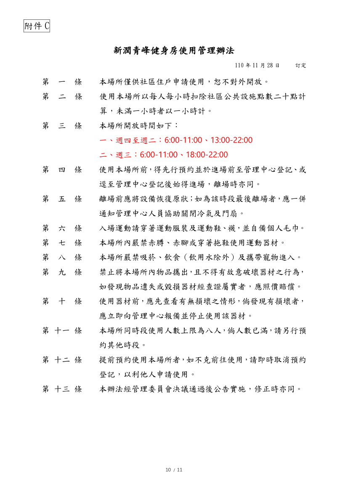
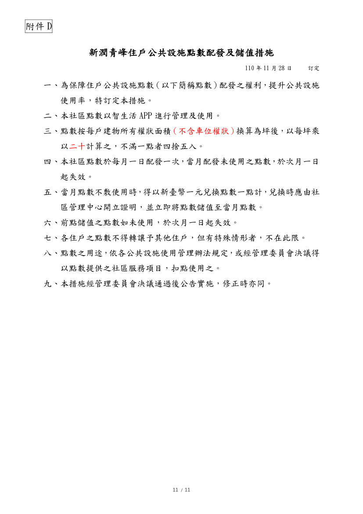