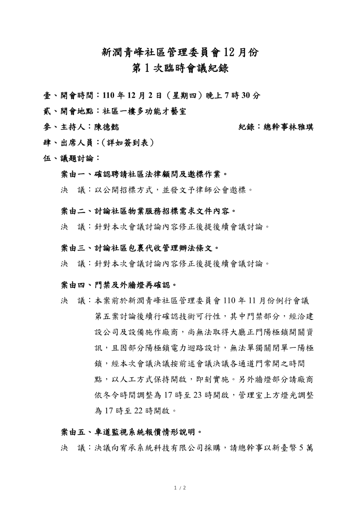
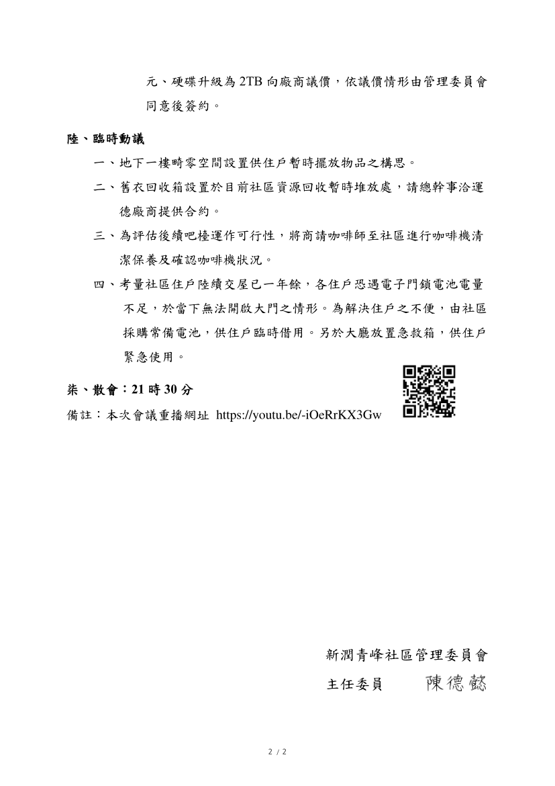

- 議題：
- 1.社區法律顧問。
- 2.物業合約內容及招標。
- 3.包裹代收管理辦法。
- 4.門禁、外牆燈再確認。
- 5.車道監視器報價。

線上會議連結：[https://youtu.be/-iOeRrKX3Gw](https://youtu.be/-iOeRrKX3Gw)

相關附件下載:

1. [110年12月份第1次臨時會議公告](../assets/post/20211202/110年12月份第1次臨時會議公告.pdf)
2. [110年12月份第1次臨時會議紀錄](../assets/post/20211202/110年12月份第1次臨時會議紀錄.pdf)
3. [110年12月份第1次臨時會議簽到表](../assets/post/20211202/110年12月份第1次臨時會議簽到表.pdf)

會議紀錄快速瀏覽:

