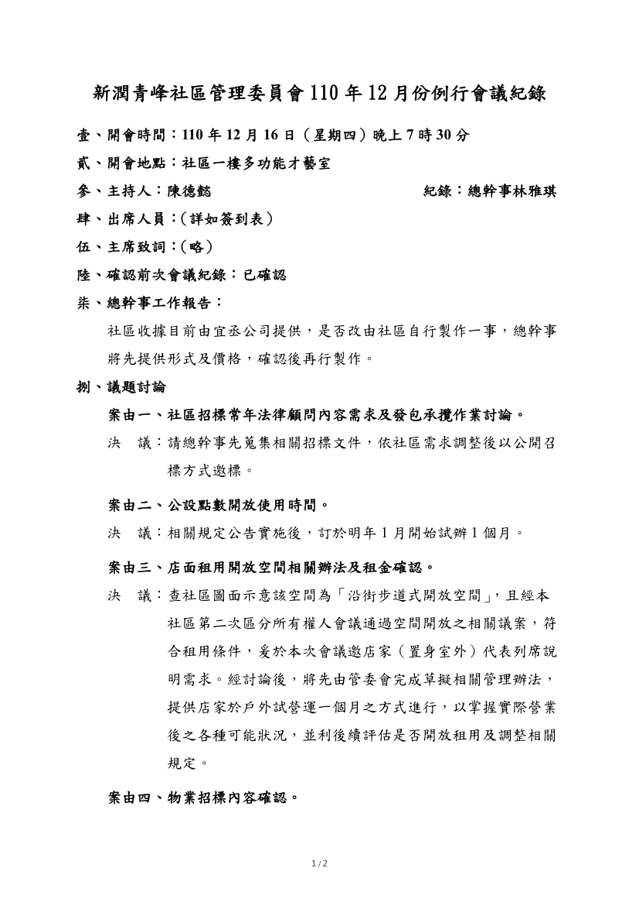
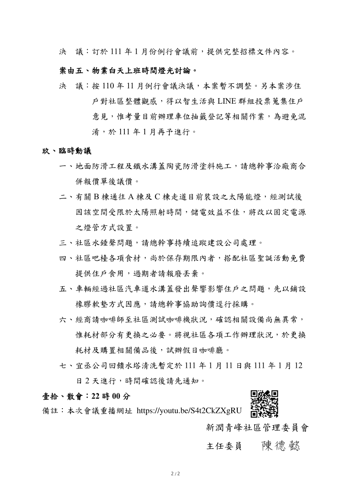

- 議題：
- 1.法律顧問聘雇需求。
- 2.公設點數發放確認時間。
- 3.店面租用開放空間相關辦法及租金確認。
- 4.物業招標內容確認。
- 5.物業白天上班時間燈光使用討論。

線上會議連結：[https://youtu.be/S4t2CkZXgRU](https://youtu.be/S4t2CkZXgRU)

相關附件下載:

1. [110年12月份例行會議公告](../assets/post/20211216/110年12月份例行會議公告.jpg) 
2. [110年12月份例行會議紀錄](../assets/post/20211216/110年12月份例行會議紀錄.pdf)
3. [110年12月份例行會議簽到表](../assets/post/20211216/110年12月份例行會議簽到表.pdf)

會議紀錄快速瀏覽:

