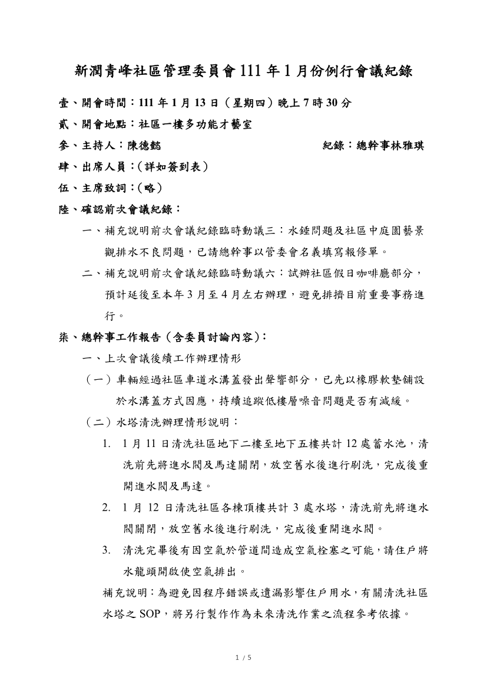

- 議題：
- 1.機車車道水溝蓋及車道地面防滑工程。
- 2.物業招標文件內容確認。
- 3.法律顧問招標事項確認。
- 4.店面租用開放空間相關辦法。

線上會議連結：[https://youtu.be/zJZ3VDiRAGg](https://youtu.be/zJZ3VDiRAGg)

相關附件下載:

1. [111年1月份例行會議公告](../assets/post/20220113/111年1月份例行會議公告.pdf)
2. [111年1月份例行會議紀錄](../assets/post/20220113/111年1月份例行會議紀錄.pdf)
3. [111年1月份例行會議簽到表](../assets/post/20220113/111年1月份例行會議簽到表.pdf)
4. [附件1－職務罷免連署書](../assets/post/20220113/附件1－職務罷免連署書.pdf)
5. [附件2－運德環保有限公司清運費用調整通知](../assets/post/20220113/附件2－運德環保有限公司清運費用調整通知.pdf)
6. [附件3－青峰社區－店面租用開放空間相關辦法](../assets/post/20220113/附件3－青峰社區－店面租用開放空間相關辦法.pdf)

會議紀錄快速瀏覽:

