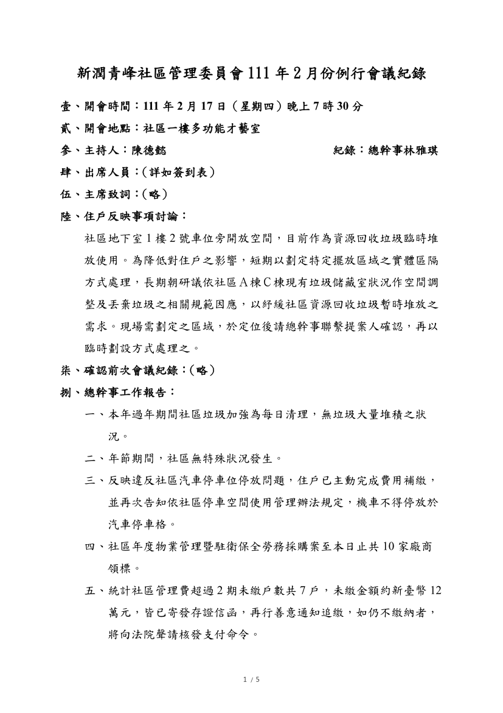
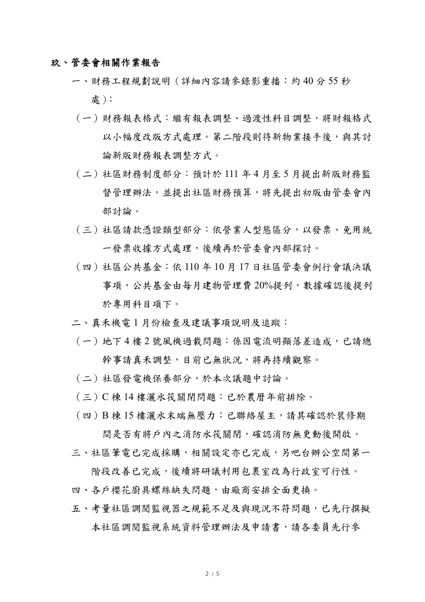
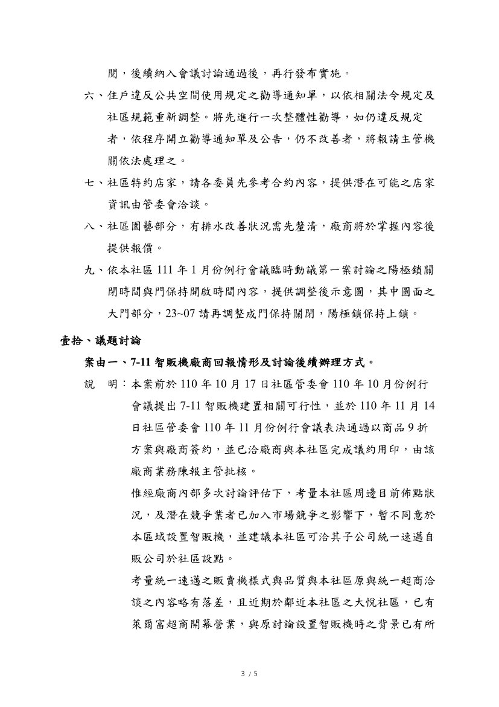
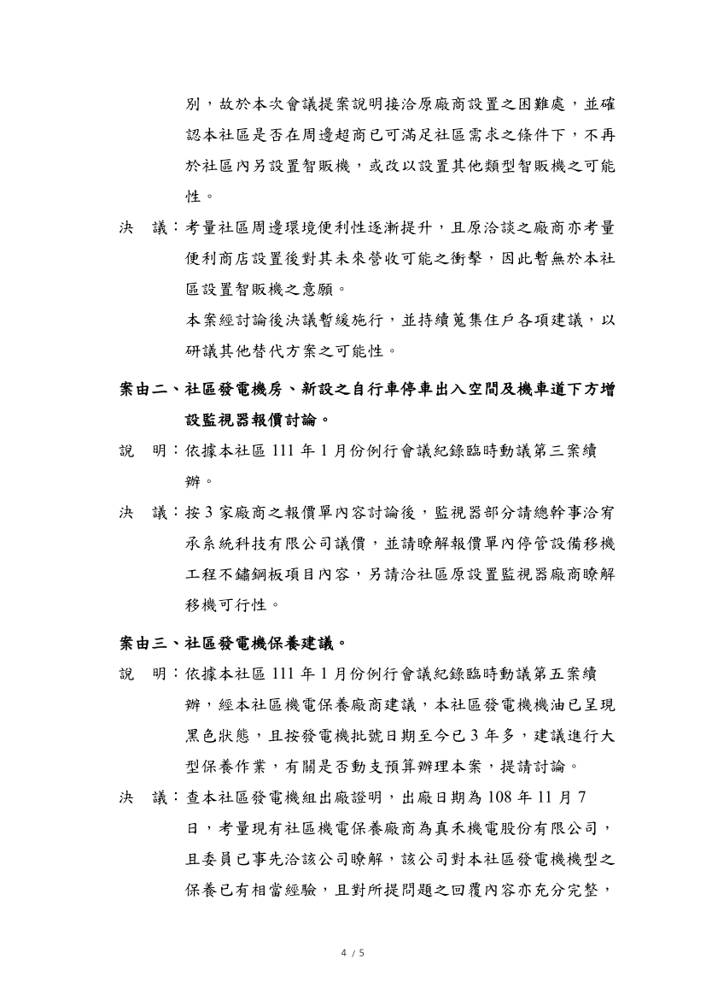
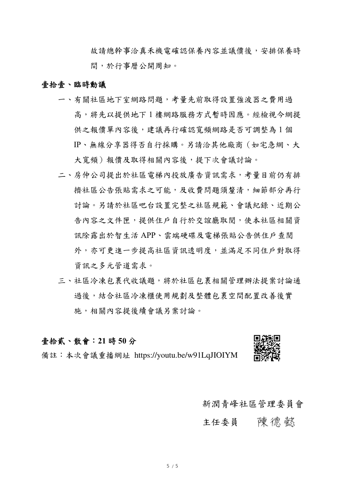

- 1.7-11 智販機廠商回報情形及討論後續辦理方式。
- 2.社區發電機房、新設之自行車停車出入空間及機車道下方增設監視器報價討論。
- 3.社區發電機保養建議。

線上會議連結：[https://youtu.be/w91LqJIOIYM](https://youtu.be/w91LqJIOIYM)

相關附件下載:

1. [111年2月份例行會議公告](../assets/post/20220217/111年2月份例行會議公告.pdf)
2. [111年2月份例行會議紀錄](../assets/post/20220217/111年2月份例行會議紀錄.pdf)
3. [111年2月份例行會議簽到表](../assets/post/20220217/111年2月份例行會議簽到表.pdf)

會議紀錄快速瀏覽:

