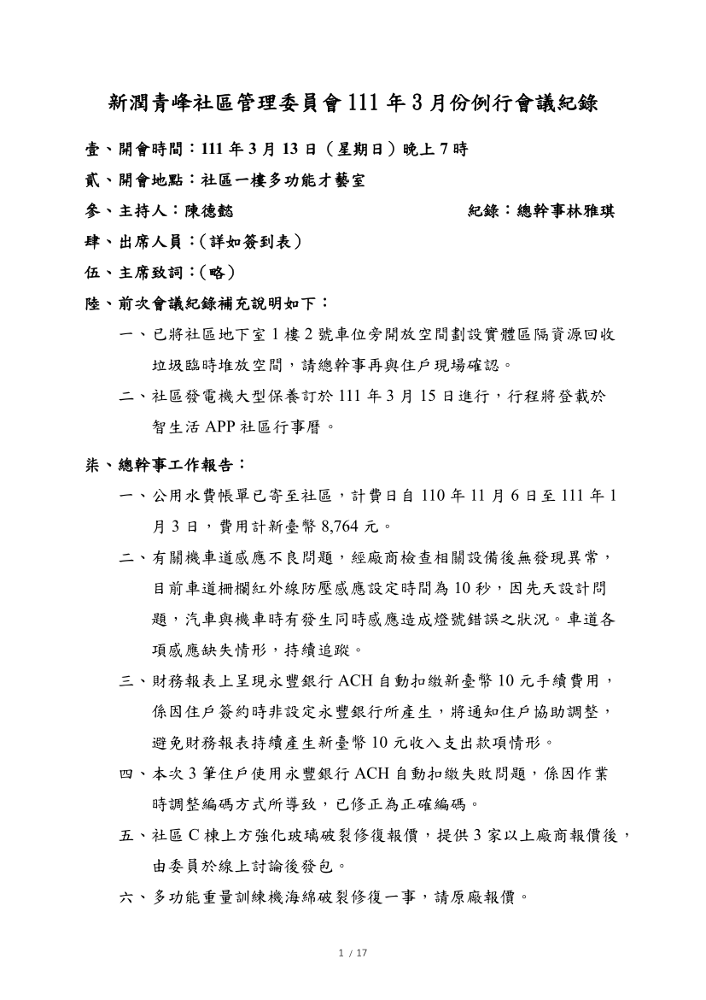

- 議題：
- 1.包裹管理辦法。
- 2.地下室 WIFI 建置。
- 3.數位監視資料調閱管理辦法。
- 4.無障礙汽車位開放預約評估。
- 5.1 樓店面使用開放空間是否開始收費及計費方式。
- 6.小公電費計價方式討論。

線上會議連結：[https://youtu.be/ba4j3muaDTU](https://youtu.be/ba4j3muaDTU)

相關附件下載:

1. [111年3月份例行會議公告](../assets/post/20220313/111年3月份例行會議公告.pdf)
2. [111年3月份例行會議紀錄](../assets/post/20220313/111年3月份例行會議紀錄.pdf)
3. [111年3月份例行會議簽到表](../assets/post/20220313/111年3月份例行會議簽到表.pdf)
4. [附件1－宅急網進駐服務簡報](../assets/post/20220313/附件1－宅急網進駐服務簡報.pdf)
5. [附件2－小公電費試算](../assets/post/20220313/附件2－小公電費試算.pdf)

會議紀錄快速瀏覽:

