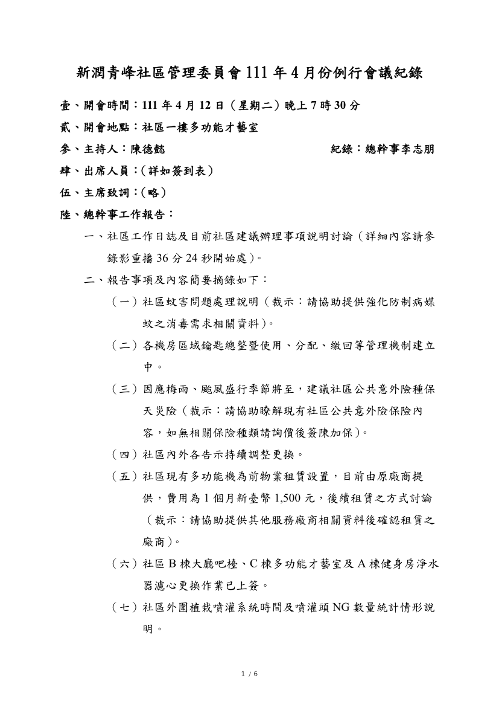
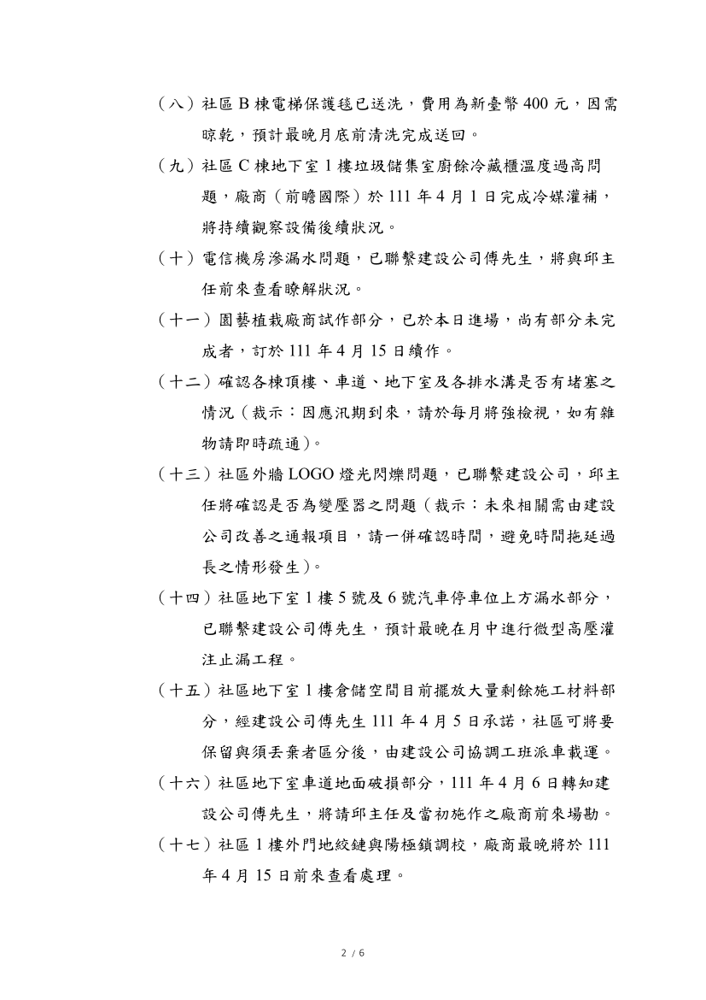
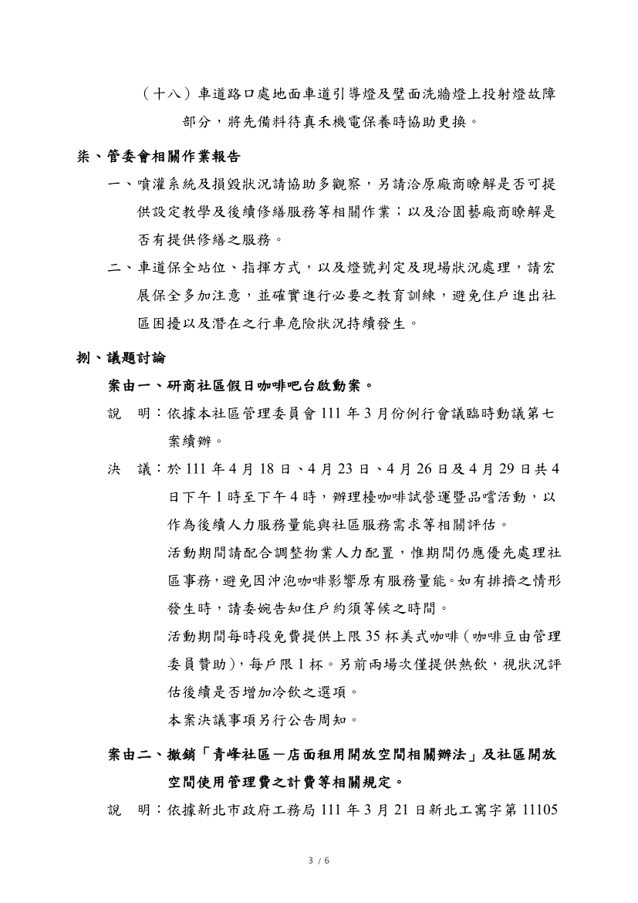
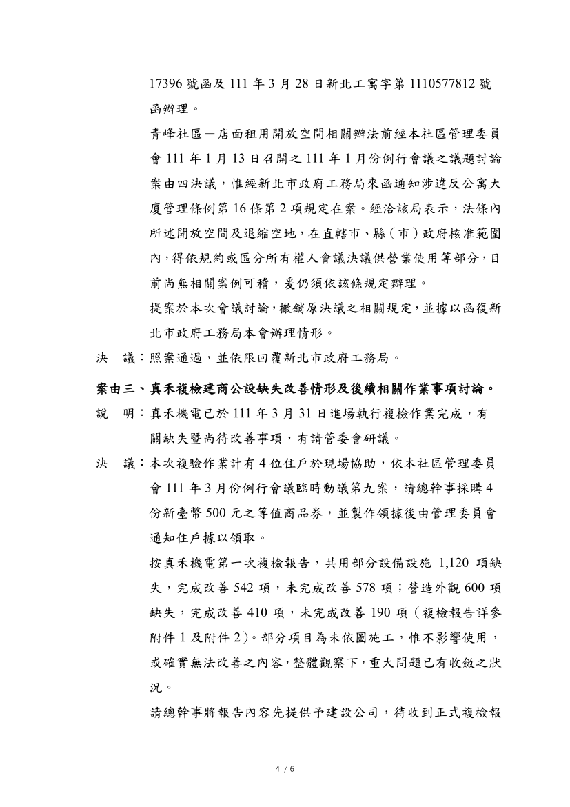
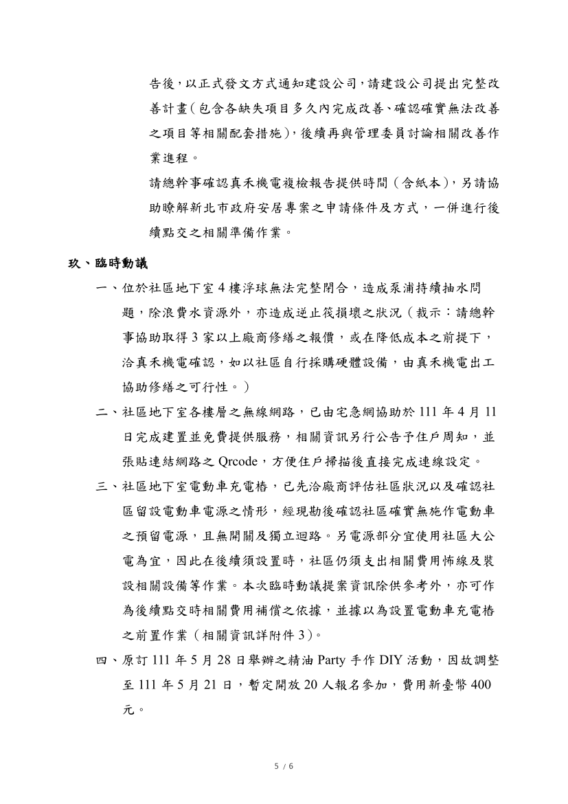
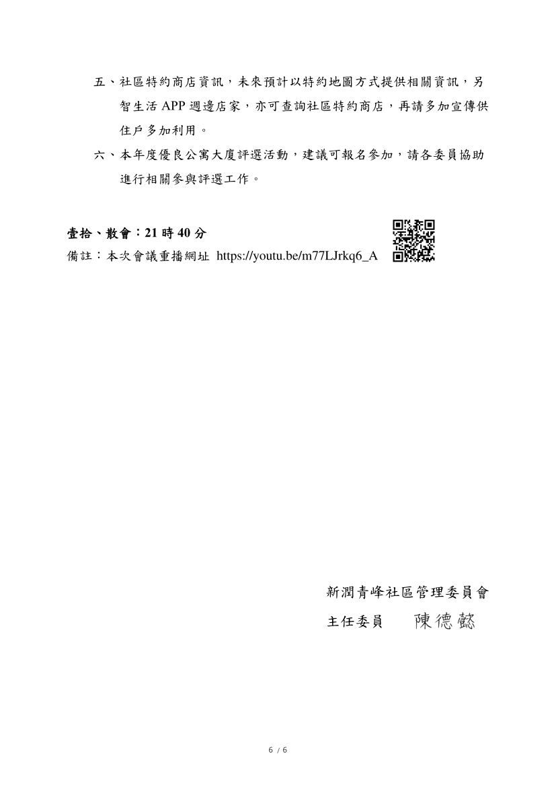

- 議題：
- 1.研商社區假日咖啡吧台啟動案。
- 2.撤銷「青峰社區－店面租用開放空間相關辦法」及社區開放空間使用管理費之計費等相關規定。
- 3.真禾覆驗缺失和建商改善事項討論。

線上會議連結：[https://youtu.be/m77LJrkq6_A](https://youtu.be/m77LJrkq6_A)

相關附件下載:

1. [111年4月份例行會議公告](../assets/post/20220412/111年4月份例行會議公告.jpg)
2. [111年4月份例行會議紀錄](../assets/post/20220412/111年4月份例行會議紀錄.pdf)
3. [111年4月份例行會議簽到表](../assets/post/20220412/111年4月份例行會議簽到表.pdf)
4. [附件1－真禾複檢報告-共用部分設備設施](../assets/post/20220412/附件1－真禾複檢報告-共用部分設備設施.pdf)
5. [附件2－真禾複檢報告－營造外觀](../assets/post/20220412/附件2－真禾複檢報告－營造外觀.pdf)
6. [附件3－家用充電規劃書](../assets/post/20220412/附件3－家用充電規劃書.pdf)

會議紀錄快速瀏覽:

