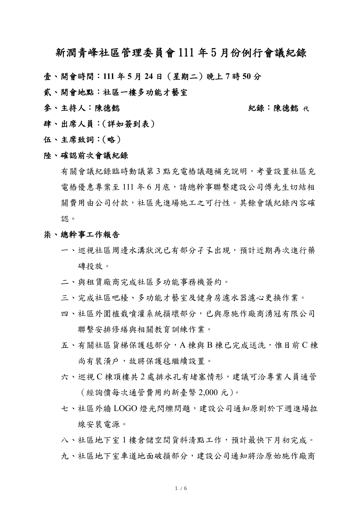
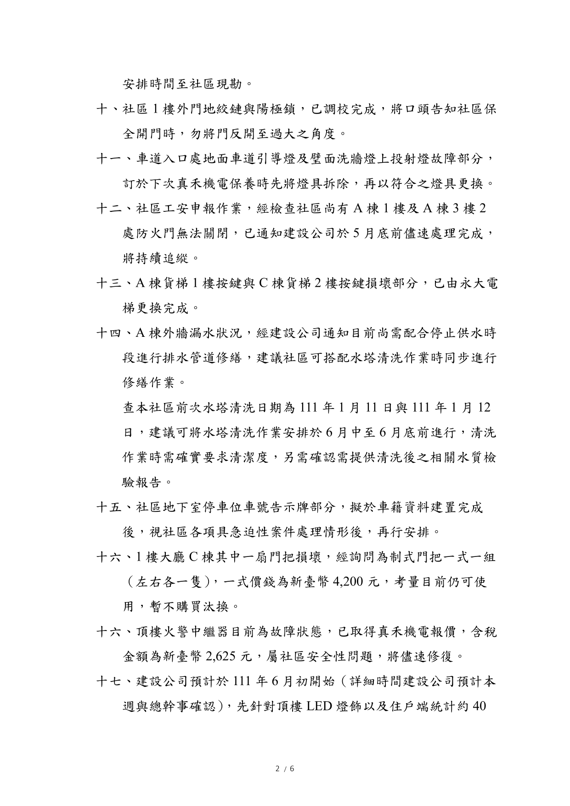
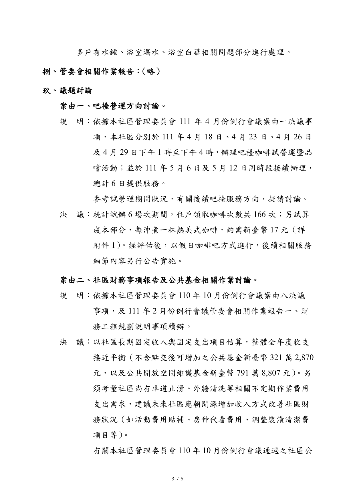
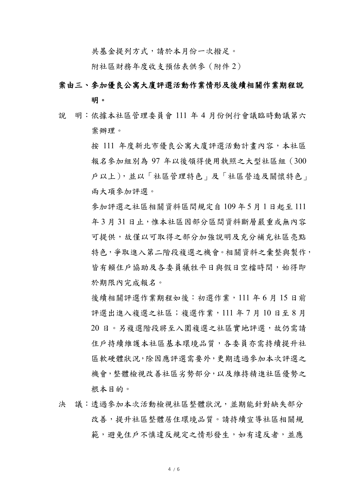
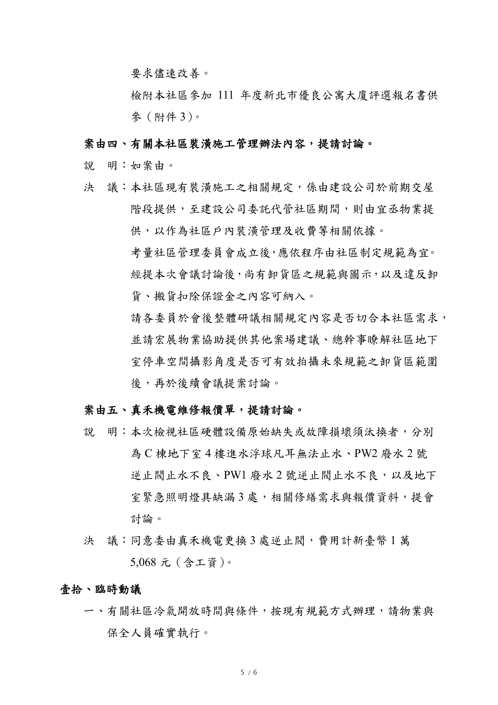
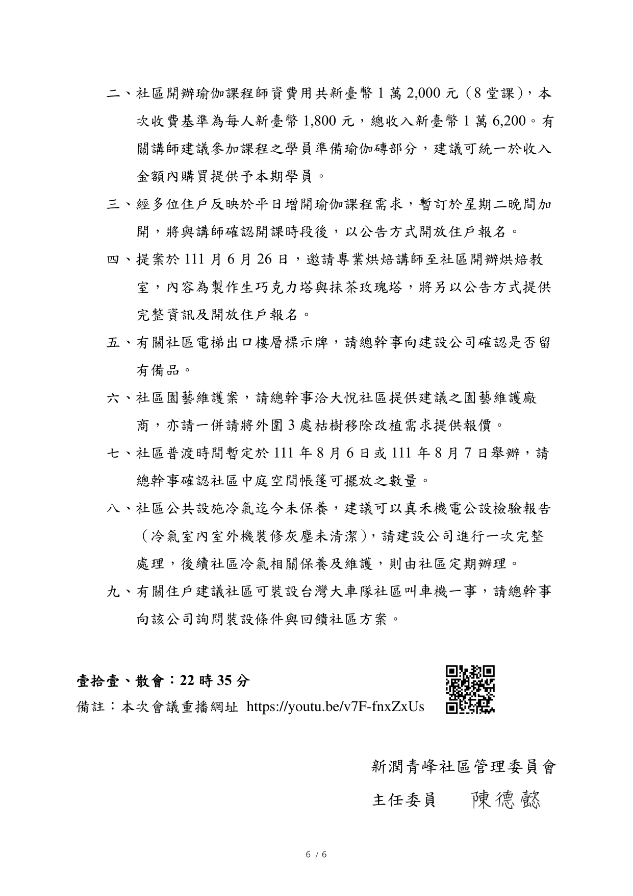

1.吧檯營運方向討論。
2.社區財務事項報告及公共基金相關作業討論。
3.參加優良公寓大廈評選活動作業情形及後續相關作業期程說明。
4.有關本社區裝潢施工管理辦法內容，提請討論。
5.真禾機電維修報價單，提請討論。

線上會議連結：[https://youtu.be/v7F-fnxZxUs](https://youtu.be/v7F-fnxZxUs)

相關附件下載:

1. [111年5月份例行會議公告](../assets/post/20220524/111年5月份例行會議公告.pdf)
2. [111年5月份例行會議紀錄](../assets/post/20220524/111年5月份例行會議紀錄.pdf)
3. [111年5月份例行會議簽到表](../assets/post/20220524/111年5月份例行會議簽到表.pdf)
4. [附件1－咖啡成本試算](../assets/post/20220524/附件1－咖啡成本試算.pdf)
5. [附件2－社區財務年度收支預估](../assets/post/20220524/附件2－社區財務年度收支預估.pdf)
6. [附件3－111年度新北市優良公寓大廈評選活動報名書－新潤青峰社區](../assets/post/20220524/附件3－111年度新北市優良公寓大廈評選活動報名書－新潤青峰社區.pdf)

會議紀錄快速瀏覽:

