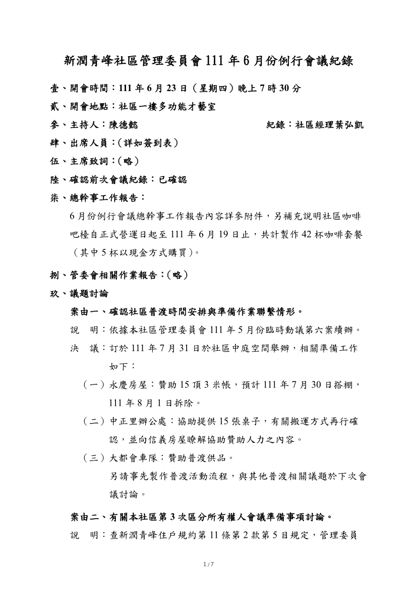
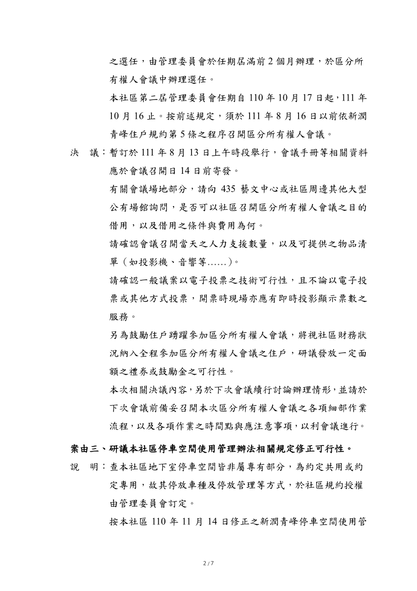
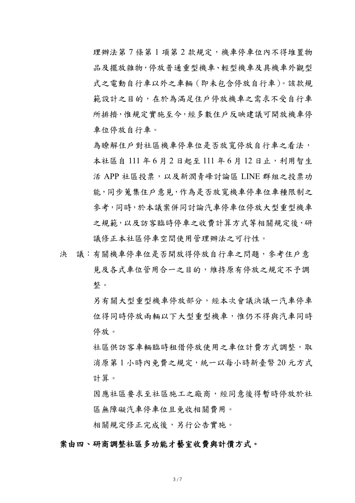
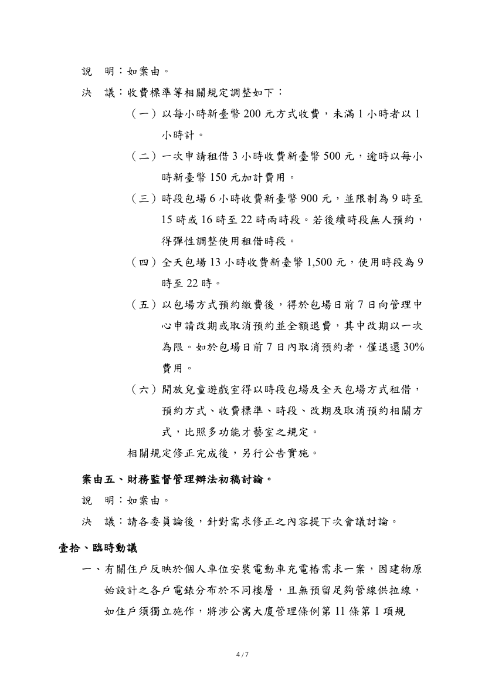
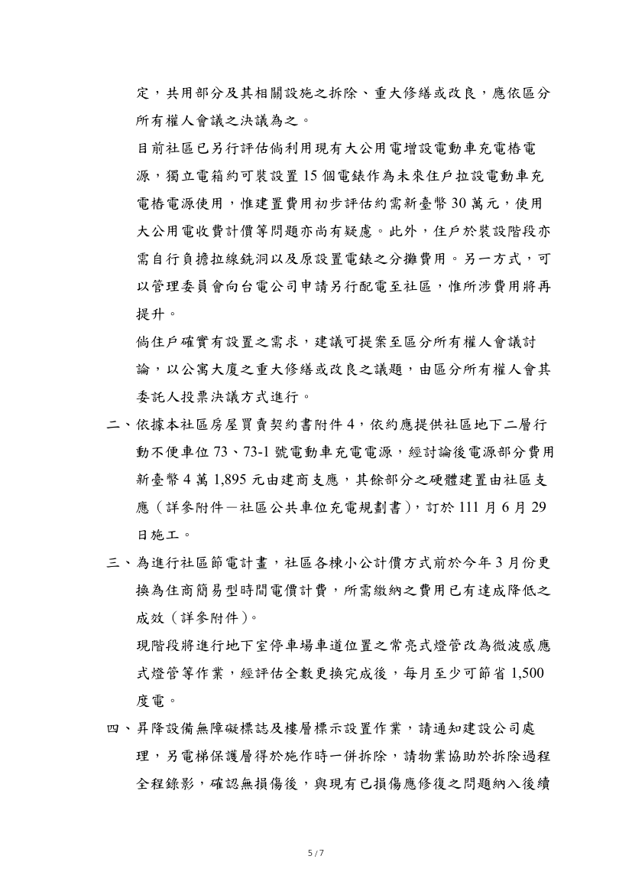
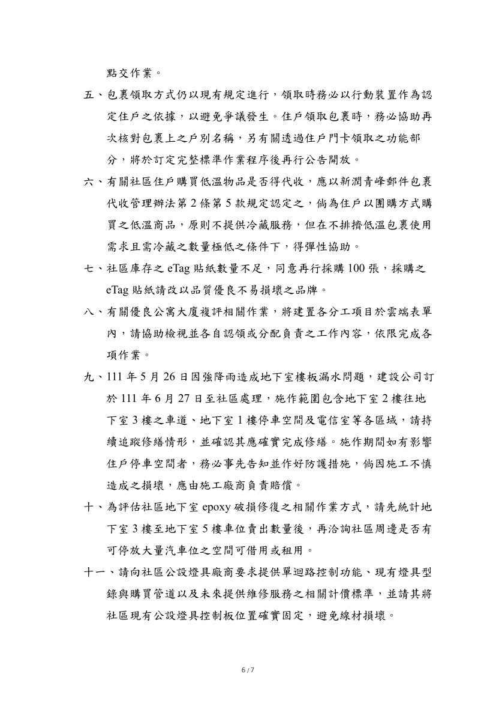
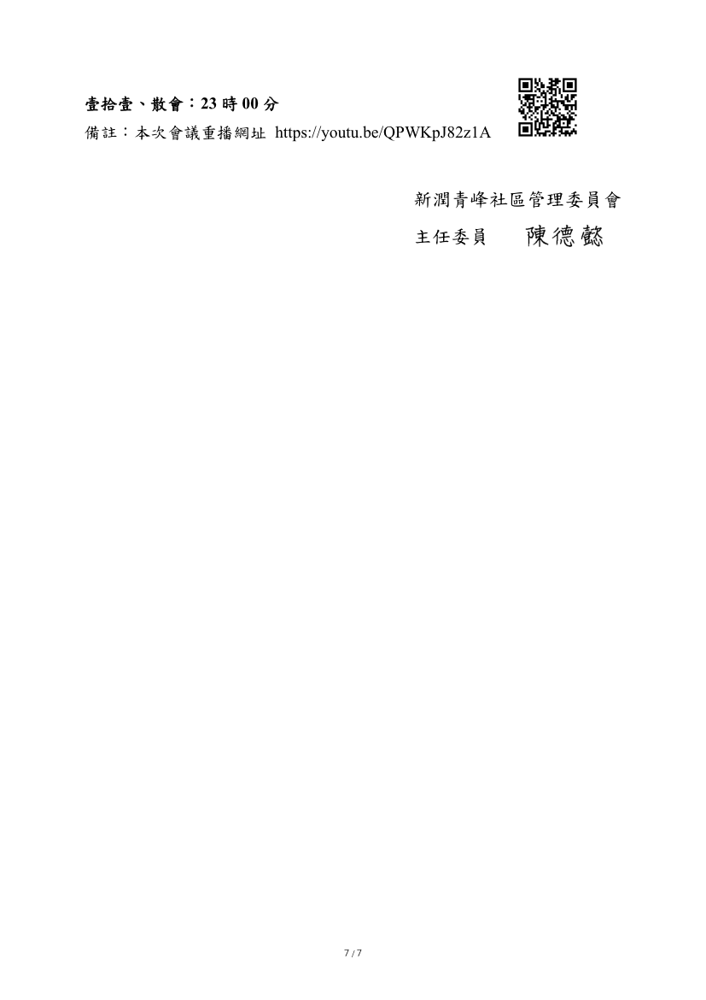
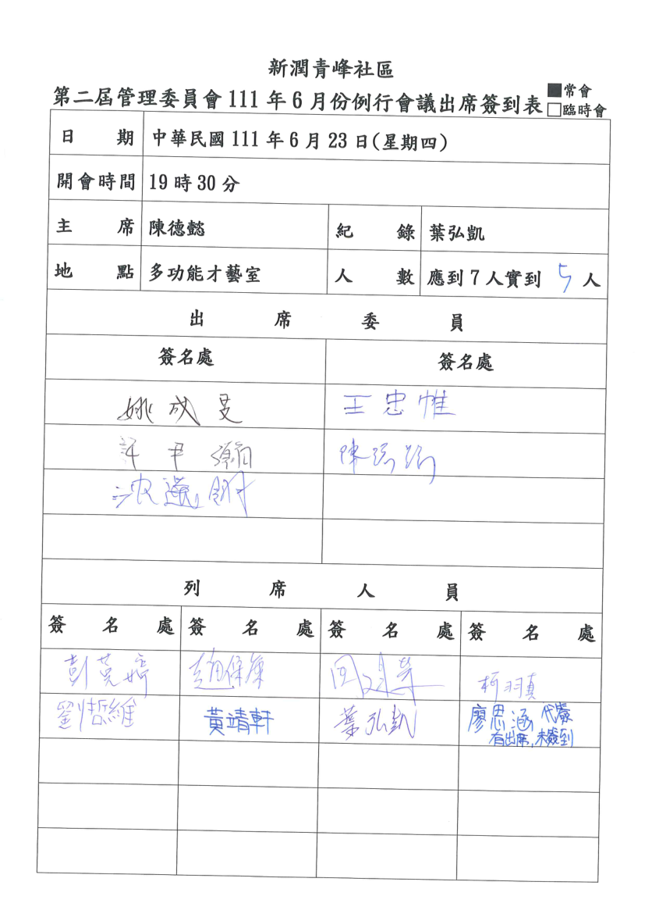

- 議題：
- 1.確認社區普渡時間安排與準備作業聯繫情形。
- 2.有關本社區第3次區分所有權人會議準備事項討論。
- 3.研議本社區停車空間使用管理辦法 相關規定修正可行性。。
- 4.研商調整社區多功能才藝室收費與計價方式。
- 5.財務監督管理辦法初稿討論。

線上會議連結：[https://youtu.be/QPWKpJ82z1A](https://youtu.be/QPWKpJ82z1A)

相關附件下載:

1. [111年6月份例行會議公告](../assets/post/20220623/111年6月份例行會議公告.pdf)
2. [111年6月份例行會議紀錄（含簽到表）](../assets/post/20220623/111年6月份例行會議紀錄（含簽到表）.pdf)
4. [附件1－6月份例行會議總幹事工作報告](../assets/post/20220623/附件1－6月份例行會議總幹事工作報告.pdf)
5. [附件2－社區公共車位充電規劃書](../assets/post/20220623/附件2－社區公共車位充電規劃書.pdf)
6. [附件3－社區公設用電情形統計](../assets/post/20220623/附件3－社區公設用電情形統計.pdf)
6. [附件4－新潤青峰社區財務管理辦法(草稿)_220623](../assets/post/20220623/附件4－新潤青峰社區財務管理辦法(草稿)_220623.pdf)

會議紀錄快速瀏覽:

