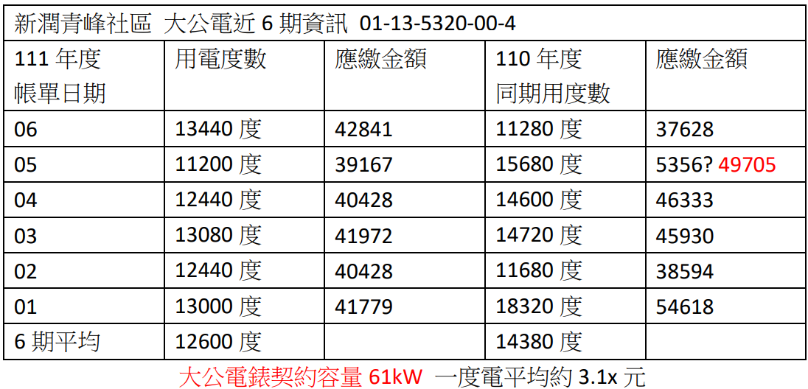

新潤青峰社區管理委員會[111年3月份例行會議](https://bq01.github.io/2022-03-13-meeting/)決議，將區的 A、B、C 棟換成住商簡易型時間電價計費。

111/03/22 跟台電申請小公住商簡易型時間電價計費，111/03/28 換錶後開始計費，到了今天已經過了三個月，來看看換計費方式的成效如何，從下表可以看出 4 月、5 月、6 月 的度數和應繳金額都明顯的減少，成效相當的不錯。  

大公的部分也有在努力，會先從地下室停車場的部分開始改變，把地下室車道常亮的燈管逐步用間隔的方式，一盞維持現有全亮，一盞換成微波感應燈管，在沒有人的時候會半亮，有人的時候才會全亮。

先換下來的燈管，可以當成未來有燈管壞掉時需要更換的備品，不會直接就丟掉浪費掉。

這樣統計下來，陸續把地下五層樓車道一半的燈換成微波感應燈管後，預計一個月至少可以幫社區大公省下 1,500 度的電。

